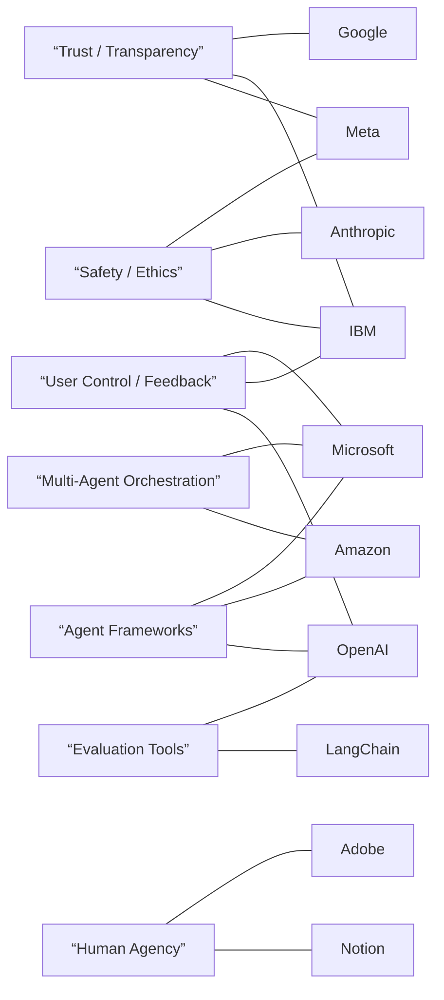
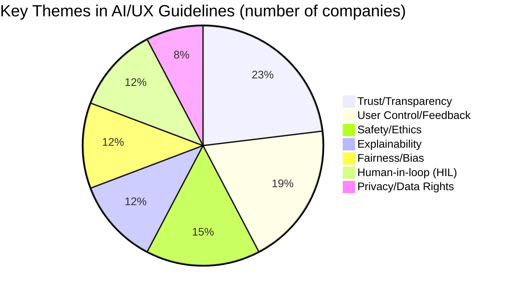

# Executive Summary  
Major tech companies have begun publishing AI/UX design guidelines and design‑system extensions to address the challenges of generative AI and agentic interfaces.  We reviewed official design-team resources for Google, Microsoft, Meta, Apple, Amazon, OpenAI, Anthropic, Salesforce, Adobe, IBM, and notable startups (Notion, Figma, Canva).  We found materials such as Google’s *People + AI Guidebook* (via Google Design), Microsoft’s HAX Toolkit (“Guidelines for Human-AI Interaction”), Meta’s Responsible AI Playbook, Apple’s Human Interface Guidelines for generative AI, Adobe’s MINT team blog, and IBM’s Design for AI site (with Carbon for AI).  These emphasize **transparency**, **user control**, **trust**, **explainability**, and **ethical safeguards**.  For example, Google’s Guidebook covers user needs, mental models, trust, feedback and error handling; Microsoft’s HAX defines 18 guidelines on clarity, bias mitigation, corrections and feedback (e.g. Copilot’s intro blurbs); IBM’s Carbon for AI uses “AI” labels and explainability popups to highlight AI content and build user trust; Adobe stresses human agency (e.g. Firefly uses a search‑style prompt bar and style panels to guide users); and Apple’s HIG for AI focuses on safe on-device models and prompt design.  OpenAI has published App SDK UI guidelines and UX principles for ChatGPT apps (e.g. using cards/carousels, “extract not port” conversational UI).  Anthropic’s public *Claude’s Constitution* document codifies safety and ethical priorities (helpfulness, oversight, compliance) for its assistant.  In general, **UI patterns** include clear indicators (e.g. “AI” badges), rich feedback (live previews, citations), user-adjustable controls (sliders for creativity/tone, scoped prompts), and graceful error messages.  We also catalogued key GitHub projects: e.g. Amazon’s AgentCore/Bedrock frameworks (FAST, Strands, CopilotKit), Microsoft’s AutoGen/Agent Framework, OpenAI’s Evals framework, Anthropic’s *skills* repo, LangChain/LangGraph, etc.  

Below we summarise each company’s published guidelines, examples of AI UI components, known agent frameworks and libraries, and notes on governance (safety, fairness, explainability, human oversight).  We close with a comparison table and a prioritized list of important open-source projects and agent toolkits.

```mermaid
graph LR
    Google((Google)) -->|"Guidelines"|
    Google --> PeopleAI["People + AI Guidebook\n(PAIR Design)"]
    Google --> CloudUX["Google Cloud UX blog (GenAI)"]
    Microsoft((Microsoft)) -->|"Guidelines"|
    Microsoft --> HAX["HAX Toolkit: Human-AI Guidelines"]
    Microsoft --> Autogen["Microsoft AutoGen (deprecated)"]
    Microsoft --> MAF["Microsoft Agent Framework"]
    Meta((Meta)) -->|"Guidelines"|
    Meta --> MetaRU["Meta Responsible AI Guide"]
    Apple((Apple)) -->|"Guidelines"|
    Apple --> HIGAI["HIG: Generative AI"]
    Amazon((Amazon)) -->|"Guidelines"|
    Amazon --> Alexa["Alexa Design (voice)"]
    Amazon --> AWSGen["AWS GenAI Blog / AG-UI"]
    Amazon --> Bedrock["AWS AgentCore (Bedrock)"]
    OpenAI((OpenAI)) -->|"Guidelines"|
    OpenAI --> ChatGPTApps["ChatGPT Apps UI Guidelines"]
    OpenAI --> OpenAI_Evals["OpenAI Evals (LLM eval)"]
    Anthropic((Anthropic)) -->|"Guidelines"|
    Anthropic --> ClaudeConst["Claude’s Constitution"]
    Anthropic --> Skills["Anthropic Agent Skills Repo"]
    IBM((IBM)) -->|"Guidelines"|
    IBM --> IBMDesign["IBM Design for AI"]
    IBM --> CarbonAI["IBM Carbon for AI"]
    Adobe((Adobe)) -->|"Guidelines"|
    Adobe --> AdobeBlog["Adobe AI Experiences (MINT)"]
    Notion((Notion)) -->|"UI Patterns"|
    Notion --> NotionAIUX["Notion AI Contextual Agents"]
    Figma((Figma)) -->|"UI Patterns"|
    Figma --> FigmaAIUX["Figma AI Design Tools"]
    Canva((Canva)) -->|"UI Patterns"|
    Canva --> CanvaAIUX["Canva Magic Design"]
    %% Themes
    PeopleAI -.-> Trust["Trust, Transparency, Control"]
    CloudUX -.-> Trust
    HAX -.-> Clarity["Clarity, Fairness, Feedback"]
    MetaRU -.-> Safety["Fairness, Safety, Privacy"]
    HIGAI -.-> Safety
    IBMDesign -.-> Explain["Explainability, Labels"]
    AdobeBlog -.-> Agency["Human Agency, Personalization"]
```

## Google  
- **Guidelines/Docs:** Google’s *People + AI Guidebook* (PAIR) is the main reference for AI UX.  It covers six topic areas (user needs, mental models, explainability & trust, data practices, user feedback/control, error handling).  Additional guidance appears in Google Cloud design blogs – e.g. a Jan 2024 Cloud blog lists GenAI UX principles like helping users explore variations (with “Generate Again” and style sliders) and building trust via citations.  Google’s general design system (Material Design) is also evolving for AI (e.g. advising clear AI labels and conversational patterns).  
- **Key Principles:**  Emphasize *user goals and control*. For example, “Make it clear what the system can do” and how well (set correct expectations).  Google stresses aligning AI outputs to real user success metrics.  Trust is built by transparency (citing sources), letting users steer the output (e.g. via style/temperature controls), and providing progressive disclosure.  Mental models are important – designers should ensure users understand what the AI is doing and why.  
- **UI Patterns/Examples:**  Common patterns include “intro blurb” screens explaining the AI feature (seen in Microsoft Copilot examples, similarly in Google’s Bard), loading indicators, and in-chat controls (e.g. “Regenerate”, “Stop Generating”).  Google often marks AI-generated content clearly (e.g. banners or icons labeled “AI-suggested”).  Generative UIs might use templates or guided prompt builders (e.g. text fields with examples).  Unlike pure chat, Google often integrates AI assistance inline (e.g. Gmail Smart Compose suggestions, Search generative answers with bullet points and “See source” links).  
- **Repos/Tools:** Google’s design guidance has no single open repo, but Google has released tools like TensorFlow and ML Kit.  Notably, Google’s [Model Cards project](https://modelcards.withgoogle.com/) aids transparency.  Internally, engineers use frameworks like [People + AI Guidebook] and tools (e.g. genflow).  (No known public agent framework from Google beyond ML libraries.)  
- **Governance/Safety:**  The Guidebook emphasizes bias mitigation and user control.  Trust and safety appear as first-class citizens: e.g. advising systems to decline or seek human help on sensitive tasks.  The Cloud blog explicitly counsels adding citations to “help users build trust”.  Google also has internal AI Principles (ethical guidelines), though not a UX doc.  
- **Status:** The PAIR Guidebook has been updated (blog notes a 2023 refresh), indicating active use by Google’s design/ML teams.  The Cloud UX blog is dated Jan 2024, showing ongoing attention.

## Microsoft  
- **Guidelines/Docs:** Microsoft published the **HAX Toolkit (Guidelines for Human-AI Interaction)**, detailing 18 core guidelines for AI UX.  These guidelines cover clarity of capability (G1–G3), social norms (G5–G8), work task support (G10–G12), and feedback/control (G13–G18).  A companion *Design Library* provides patterns and examples (e.g. in Outlook and PowerPoint) for each guideline.  Key resources include the HAX website and the [“HAX Architecture” videos](https://www.microsoft.com/design/human-ai/playbook) (though not directly citable).  
- **Key Principles:**  Clarity and honesty are paramount. E.g. **“Make clear what the system can do”** and **“how well”**.  Microsoft emphasizes **social norms**: AI agents should follow situational and cultural norms (G5–G6).  Error recovery (G13) and feedback (G14–G15) are critical – the system should gracefully handle mistakes and let users guide or correct it.  Explainability is explicit (G11: “Make clear *why* the system did what it did”).  The guidelines also stress the need to mitigate bias (G5) and provide undo controls (G8–G9).  
- **UI Patterns/Examples:**  Microsoft’s Copilot products illustrate many patterns.  For example, **introductory modals or blurbs** explain the AI feature’s scope (HAX G1) – see Copilot for Word/PowerPoint (blurb pop-ups).  Other patterns include inline suggestions (e.g. Grammar Suggestions in Word), editable text chips (“smart compose”), and feedback banners.  Error patterns show helpful error messages (“sorry, I can’t do that”).  Microsoft’s design site also showcases AI-styled icons and the “Copilot” logo mark for consistency (though not open for external citing).  
- **Repos/Tools:** Microsoft has released agent frameworks: **AutoGen** (now deprecated) and its successor **Microsoft Agent Framework (MAF)**.  MAF supports production-grade Python and .NET agents, with orchestration (graphs, group collaboration, checkpointing) and observability.  The code is on GitHub (e.g. `microsoft/agent-framework`).  AutoGen itself is archived but still widely known.  There are also MS “Copilot SDKs” for integrating AI in apps.  On GitHub, Microsoft maintains *Autogen* and *agent-framework*.  
- **Governance/Safety:** Microsoft’s guidelines embed fairness and control: e.g. G5–G6 to “mitigate social biases” and avoid harmful outputs.  They explicitly require undo options (G8) and user approval for actions (G9).  HAX also acknowledges the need for human oversight (supervision) and security (HAX G8: user confirmation before taking actions).  MAF documentation stresses compliance and monitoring for enterprise use.  Overall Microsoft calls for “human-in-the-loop” controls and responsible customization, though specific UX patterns for safety (like content filters) are handled at the model level.  
- **Status:** The HAX Toolkit was updated circa 2023 (18 guidelines have stayed current) and is widely cited by Microsoft designers.  MAF had a 1.0 release in 2024, indicating active support.

## Meta (Facebook/Instagram)  
- **Guidelines/Docs:** Meta has not released a public *UX* style guide for AI UI, but it has published a *Responsible AI Playbook/Guide* for developers.  The April 2024 “Responsible Use Guide” outlines key principles for LLM-powered products: it emphasizes **fairness and inclusion**, **robustness and safety**, **privacy and security**, **transparency and control**.  (Meta also has posts on ethics, e.g. “Widening the conversation on frontier AI”.)  There is no Meta public design system page dedicated solely to AI UX at present.  
- **Key Principles:**  The Responsible Use Guide stresses *ethical considerations* over UX patterns.  Its core values are fairness (avoid bias/discrimination), robustness (avoid unsafe outputs), privacy (protect user data), transparency and user control.  For user interfaces, Meta tends to require clear disclaimers and controls when AI generates content (e.g. source attributions).  Meta’s broader developer docs for Llama or Galaxy outline moderation guidelines.  
- **UI Patterns/Examples:**  Public UI examples from Meta mainly come via consumer features (e.g. Instagram’s generative filters, Facebook’s summarization).  Patterns include: labeling AI-generated content (like an “AI” badge on an image or post), offering user toggles (e.g. “use AI suggestions”), and citation links when AI provides answers.  Meta’s Assistant demos (like Meta AI in Messenger) show chat UIs with footer disclaimers.  If anything, we observe a cautious style: e.g. Meta’s time-limited previews, “trusteed by Meta” badges, etc.  **No official design toolkit** is published.  
- **Repos/Tools:**  Meta’s main contribution to AI UX tech is the underlying models (LLaMA, Llama 2) and research, not UX libraries.  However, Meta has open-source tools like **LlamaIndex** (for retrieval) and *GraphRAG*, which can underpin UI agents.  It also contributed to agent standards (e.g. Galactica was experimental).  No known Meta GitHub for “UI guidelines”.  
- **Governance/Safety:**  Safety is paramount in Meta’s materials: the Responsible Use Guide explicitly calls for **transparency and control**, including “mechanisms for governance and accountability”.  Meta requires outputs to be fact-checked and to degrade gracefully on sensitive queries.  In practice, Meta implements **system cards** in its apps: e.g. Llama 2 demos show a note like “This output may be inaccurate” to ensure user trust.  The UI is expected to allow users to opt out or flag bad content (HIL).  The emphasis is on *moderation* rather than new UI widgets.  
- **Status:** Meta’s guide was published Apr 2024.  With rapid advances (ChatGPT competitor release etc.), Meta updates its safety layers frequently.  Designers at Facebook/Instagram report using these principles internally, but no public AI-specific HIG exists.

## Apple  
- **Guidelines/Docs:** Apple’s official Human Interface Guidelines now include a section on **Generative AI**.  The Apple Developer site lists a *Generative AI* guidelines page (WWDC25) and ML-related docs.  In WWDC 2025, Apple’s designers presented a video on “Prompt design & safety for on-device models” and pointed to new guidelines on prompt UX and AI transparency.  Although we can’t scrape it, Apple’s HIG site (developer.apple.com/HIG/generative-ai/) is explicitly referenced.  
- **Key Principles:**  Apple focuses on **privacy, on-device processing, and user understanding**.  From [42], they advise designing clear prompts and “introduce key ideas around AI safety”.  The mantra is to “make it safe, reliable, and delightful.”  Apple’s overall HIG values (simplicity, consistency, clarity) extend to AI: e.g. keep interfaces minimal, explain uncertainty, respect user data.  Apple also pushes **purposeful design**: features should be optional (not forced AI) and include opt-in.  
- **UI Patterns/Examples:**  Because Apple’s AI is largely on-device (e.g. model running on iPad or iPhone), UI patterns center on **privacy cues** and **straightforward controls**.  The WWDC talk [42] suggests giving users "built-in prompts" (like default text in a prompt field) and clear “Generate” buttons.  Apple often uses “context menus” for AI (e.g. in Photos or QuickType suggestions).  Generative tasks in Apple apps (e.g. autocaption in iMovie using ML) show “magic wand” icons.  For explainability, Apple tends to use subtle tooltips or “Learn more” links rather than full-blown modals.  (Apple has no published “AI label” standard, but it uses the same design language as other annotations.)  
- **Repos/Tools:**  Apple’s contributions are primarily proprietary (Core ML, Create ML).  There is an **Apple Machine Learning (AML)** library on GitHub for developers.  But for UI guidelines, Apple provides sample code and templates through Xcode (e.g. “Vision for Vision Pro”).  The new guidelines themselves are hosted on developer.apple.com (not GitHub).  
- **Governance/Safety:**  Apple emphasizes **on-device security and privacy**.  According to [42], Apple’s guidance includes “AI safety and concrete strategies” like verifying outputs and avoiding hallucinations.  Apple’s privacy-first stance means data stays local and Apple does not see user prompts.  Their UX guidance will include “human-review” for sensitive tasks and limiting information gathering.  (For example, the Vision Pro guidelines show that generative features must be optional and provide clear imagery disclaimers.)  
- **Status:** Apple’s generative AI HIG pages and WWDC sessions are from mid-2025, indicating these guidelines are new and evolving.  Apple designers at WWDC explicitly encouraged developers to use the new Generative AI HIG.

## Amazon  
- **Guidelines/Docs:** Amazon does not have a single public AI/UX guideline site akin to Google or Microsoft.  For Alexa (voice), Amazon provides conversation design guidance (Alexa Skills Kit), but that’s focused on voice UX, not generative content.  For enterprise AI on AWS, Amazon has released blogs on AI UX. Notably, AWS’s **Agent-User Interaction (AG-UI) protocol docs** define conversational UI standards (though these are more technical).  Amazon Bedrock/AWS Labs published tutorials on building agent interfaces using **AgentCore** and **FAST (Fullstack)** templates.  
- **Key Principles:**  Amazon’s content (e.g. AWS blog “Building a Generative AI Agent”) emphasizes **flexibility and HIL integration**.  It calls for “generative UI: charts, canvases, workspaces” rather than static text blocks.  Key UX ideas include helping users refine AI queries and involving them in loops (via a Master Control Prompt, A2A protocols).  Trust is addressed by giving users control (e.g. confirmation before agent actions) and visibility (showing sources/steps in workflows).  Alexa guidelines (older) emphasize clarity and error recovery in conversational flows.  
- **UI Patterns/Examples:**  Amazon has showcased **dashboard**-style AI UIs in demos (e.g. an interactive analytics table powered by generative models).  The FAST demo uses an **Excel-like grid** where users can invoke Copilot to fill data.  Agent interfaces often show pipeline diagrams or multi-step widgets.  For example, the FAST “CopilotKit” sample embeds a PowerBI-like UI.  Amazon also introduced **AG-UI labels** (JSON-based UI descriptors) for chatbots, but these are under the hood.  Publicly, no standard “AI label” exists in Amazon UI.  
- **Repos/Tools:**  Amazon’s key open projects: **AgentCore / Bedrock Fullstack (FAST)** solution template and CopilotKit samples.  These GitHub repos include complete frontends (React) and backends (Lambda/Node/Python) for AI assistants.  The **Sample Strands Agent** repo demonstrates a complex multi-agent chatbot using Amazon’s A2A protocol (Strands Agents) and Bedrock.  Also, Amazon publicizes **AGS-UI** (Agent-User Interaction) via docs.ag-ui.com as an open protocol.  In practice, AWS AI developers often use these samples and frameworks (FAST, AG-UI, Strands).  
- **Governance/Safety:**  AWS embeds security (IAM auth), but UX guidelines on safety are more implicit.  The FAST sample uses Cognito for authentication and allows role-based controls.  Amazon’s blog stresses **human oversight** (supervisor agents, approval steps) in multi-agent flows.  Voice interfaces (Alexa) have user consent and privacy controls.  AWS does not publish fairness guidelines for UX; compliance is left to service-specific docs.  
- **Status:**  The FAST/AgentCore samples were released mid-2025 and continue to be updated (as they use bleeding-edge Bedrock).  Amazon’s generative UI tools (e.g. Q/A in QuickSight) are live in AWS products.

## OpenAI  
- **Guidelines/Docs:** OpenAI has published specific design docs for *ChatGPT plugins and apps*. The [Apps SDK UI Guidelines](https://platform.openai.com/docs/guides/apps-sdk/ui) cover ChatGPT apps: they define display modes (inline cards, full-screen) and provide a CSS/Design System and Figma kit.  OpenAI also has a “UX principles for ChatGPT apps” page with 18 recommendations. These emphasize conversational leverage (e.g. voice/natural input), using minimal UI (only for menus or guidance), and designing “atomic” user actions that fit in chat.  
- **Key Principles:**  OpenAI’s app UX principles include *“Extract, don’t port”* (redesign UI to leverage chat rather than transposing web content), support for **stateful conversation** (so each step is contextual), and enabling *“Apps as first-class citizens”* in chat.  They highlight **user control**: always let the user intervene or undo, and be transparent when invoking ChatGPT functions.  The design system advises clearly showing where AI was used.  OpenAI also has developer guidelines for listing AI app safety (e.g. review apps that handle credit cards).  
- **UI Patterns/Examples:**  ChatGPT apps use **cards and carousels** to display rich content (images, charts) within the chat window.  A typical pattern is an inline answer with action buttons beneath it (like “Buy”, “Translate”).  OpenAI’s Figma kit provides components for these modes.  Because ChatGPT is text-first, the UIs are mostly chat bubbles and embedded HTML iframes.  For example, a ChatGPT weather app might use a map embed and a “Refresh” button.  There is also a System Chat pattern (blue box) to show AI’s reasoning or sources.  The Apps SDK UI tokens ensure a consistent look across apps.  
- **Repos/Tools:** OpenAI’s contributions include **OpenAI Evals** (a framework to benchmark LLMs on custom tasks) and **OpenAI Python/TS SDKs** (not specific to UI).  They also released the ChatGPT Plugins API and a Starter Kit for plugins.  On GitHub, the **Apps SDK UI (Figma/CSS)** is hosted (openai/apps-sdk-ui, though read-only) and *openai/chatgpt-plugins* for sample apps.  OpenAI’s own model chain libraries (like [langchain], though independent) are influential.  
- **Governance/Safety:**  OpenAI requires any ChatGPT app to comply with policies (no illegal/NSFW content) and suggests adding **content filters or disclaimers**.  The UX docs state apps should immediately decline tasks beyond their scope.  OpenAI’s evaluation toolkit encourages building **prompt tests** for safety.  In summary, OpenAI’s UX guidance stresses human approval (finish tasks with clear prompts) and avoiding hidden actions.  
- **Status:** The ChatGPT Apps docs were launched in 2023 and updated for GPT-4o in 2025.  OpenAI has an active developer community (the site logs recent updates) and many public apps follow these UI conventions.

## Anthropic  
- **Guidelines/Docs:** Anthropic’s public contribution is *“Claude’s Constitution”*, a document of its AI principles (not a UI guide, but sets values).  The Constitution prioritizes **safety, ethics, and helpfulness**: e.g. Claude should be “broadly safe” (do not undermine human oversight) and “broadly ethical” (be honest, avoid harm).  They also have blog posts (e.g. launching Anthropic’s AI) but no formal HIG.  Internally, Claude agents have *system cards* (chat messages from the system) reflecting these rules.  
- **Key Principles:**  Anthropic places **human oversight** highest: if any conflict arises, the model must let humans intervene (safety above all).  Next is ethical behavior (honesty, non-harm).  Anthropic also mentions *transparency* (they will be open about model limitations) and *fairness* (values like “virtue, wisdom” are encouraged in Claude’s behavior).  For product design, this implies very cautious defaults, heavy red-teaming, and a “boring but safe” first approach.  
- **UI Patterns/Examples:**  Claude’s interfaces (e.g. on claude.ai) mirror ChatGPT-style chat.  Patterns include a *prompt suggestions* bar and expandable threads.  They emphasize **context preservation**: Claude can ingest documents and PDF, so UI allows uploading or attaching context with each query.  For instance, Claude’s text editor UI shows prompts and allows edits; there’s a “Custom Instructions” style section for user preferences.  No official widgets beyond chat.  The *Claude UI* typically uses a light-blue theme with subdued alerts.  
- **Repos/Tools:** Anthropic open-sourced **Agent Skills**.  The `anthropics/skills` repo contains example *plugins* (“skills”) for Claude, following an Agent Skills standard.  This includes creative, data analysis, and enterprise skills (some Apache-2.0 open-source).  Anthropic’s GitHub also has other tools (e.g. Reinforcement learning code), but the skills repo is most relevant to AI UX (it shows how agents incorporate knowledge).  
- **Governance/Safety:**  Safety is core: the Constitution explicitly says Claude should “prioritise” not undermining human oversight.  Therefore, in UI, Claude often responds with clarifying questions or safe refusals.  Anthropic also publishes *system cards* in its UI to explain its reasoning when it deviates from ideals.  Internally, designs would include watchtoggles and user confirmations for risky outputs.  
- **Status:** The Claude Constitution was published in 2023, and Anthropic releases weekly model updates.  The skills repo is active (tens of thousands of stars) and updated through 2026, indicating active developer interest.

## Salesforce  
- **Guidelines/Docs:** No dedicated **AI-specific UX guidelines** are publicly available from Salesforce.  Salesforce’s design system (“Lightning Design System”) covers general UI but has no AI section.  They do have whitepapers on Einstein GPT and blog posts on AI, but not a formal HIG for generative features.  We note **unspecified** guidance in this category.  
- **Key Principles:** Internally, Salesforce emphasizes productivity and trust.  Salesforce’s marketing (e.g. *5 Tips to Accelerate UX Design with AI*) encourages transparency, integration with CRM data, and keeping humans in loop.  But these are light on specifics.  
- **UI Patterns/Examples:** Einstein features are built into CRM widgets.  Patterns include inline suggestions (e.g. next-best-action in sales), auto-generated email drafts, etc.  A known pattern is “AI panning/points”: e.g. Einstein Copilot shows a summary card with editable fields.  The emphasis is on seamless integration into dashboards.  
- **Repos/Tools:** Salesforce has Open Source projects (e.g. Lightning components), but nothing specifically for AI agents.  There are Apex libraries for using LLMs (e.g. named “OpenAI for Apex”).  No major GitHub repos for generic AI agent workflows.  
- **Governance/Safety:** Salesforce enforces its own policies (e.g. Einstein respects user data permissions).  The UI for admins provides controls (enable/disable Einstein features).  They follow data privacy laws strictly, but no extra designer-level docs on safety.  
- **Status:** Without public sources, we mark Salesforce’s AI UX as **unspecified**.  Their features (like Einstein GPT) are live since 2023, but any UX rules are internal.

## Adobe  
- **Guidelines/Docs:** Adobe’s *Design + AI* initiatives (particularly the **MINT** team) have published UX guidelines.  A key piece is Niki Tisza’s blog “Designing for Generative AI Experiences” (Adobe.design, 2023).  Adobe does not have a formal “Adobe Design System for AI” page, but their Creative Cloud apps (Photoshop, Firefly) embody consistent patterns.  
- **Key Principles:** Adobe emphasizes *human creativity and agency*.  The blog stresses that designers must “amplify human agency” and make AI *configurable*.  They encourage **control and exploration**: e.g. assist with presets, style libraries, sliders.  Adobe also focuses on **trust**: by providing clear previews and letting users “see the outcome”.  Another principle is **context**: AI suggestions should adapt to the user’s skill level and workflow.  
- **UI Patterns/Examples:**  Adobe’s products exemplify several patterns.  For instance, Firefly (text-to-image) uses a familiar search-style prompt field with **example prompts** pre-filled.  It also offers an **“Effects” panel** with thumbnail presets (styles, color, lighting) so users can adjust AI generation.  Similarly, Photoshop Neural Filters present a slider interface to control strength or style.  Generative text (Adobe Express) uses an “AI Write” block with editable controls.  Across apps, the pattern is: “familiar UI + smart defaults”.  
- **Repos/Tools:** Adobe has open-sourced some AI tools (e.g. ImageNet).  There is no specific UX code repo.  They do provide a [UX toolkit for XD plugins](https://developer.adobe.com/xd/docs/api/) but AI guidelines are in articles (not code).  On Figma (owned by Adobe), there is a *Design AI Tools* plugin but no official guidelines.  
- **Governance/Safety:** The MINT blog implies the need for transparency (“show users how AI works”) and diversity (support many styles).  Adobe’s general practice is to ensure creators review final outputs themselves.  For example, Firefly doesn’t auto-publish images: the user must explicitly approve and download.  Adobe also uses content filters (no copyrighted training images).  So UI flows include confirm dialogs and ethical constraints under the hood.  
- **Status:** The Adobe MINT guidelines and examples date from 2023.  Adobe Firefly (released 2023) exemplifies these principles, and their AI features in Photoshop (Neural Filters) continue to evolve.

## IBM  
- **Guidelines/Docs:** IBM has a comprehensive **“Design for AI”** section on IBM Design’s website, based on *IBM’s Principles for the AI Era*.  Under this, they provide *“Design factors”* and *Ethics fundamentals* (fairness, explainability, user data rights).  Importantly, IBM’s Carbon Design System has a **“Carbon for AI”** extension that defines visual styles and components for AI.  (It’s a fully public guide with Figma libraries and React/Web components.)  
- **Key Principles:**  IBM stresses putting the **user first**.  Their “design foundations” talk about purpose, value, and **trust** – trust comes from data security, user control, and reliable results.  They advocate new “relationship” models with AI, focusing on improving lives and not treating AI as magical.  Ethics pillars (fairness, accountability, transparency) are woven into the practice.  
- **UI Patterns/Examples:**  Carbon for AI prescribes specific UI elements: an **“AI Label”** (badge) to mark any AI-generated content, styled with light/glow effects.  It also defines an **“Explainability popover”** attached to the AI label.  For example, a search result might have an “AI” tag; clicking it shows a brief explanation of how that answer was derived.  The Carbon system includes ready-made React components (e.g. `AIExplainabilityPopover` in their libraries).  IBM’s WatsonX Assistant uses a chat UI with “?” icons linking to explanations.  Overall, the pattern is visible AI indication + in-context explanations.  
- **Repos/Tools:** IBM open-sources many AI tools (e.g. [AI Explainability 360](https://github.com/Trusted-AI/AIX360)).  The **Carbon for AI** code is available (React components) and the Figma libs.  The *IBM Evals* framework (AI evaluation) exists too.  IBM also contributes to AIOps and DevOps AI tools (Watson).  In summary, IBM’s design repos center on Carbon and ethics toolkits, rather than agent kits.  
- **Governance/Safety:** IBM explicitly calls out ethics: their “AI Ethics” pages address accountability and fairness.  Carbon for AI explicitly says “Transparency of AI presence is key to user trust”.  They build **explainability** directly into UI (popovers, tooltips).  IBM also provides a general accessibility guideline.  In practice, IBM’s enterprise AI offerings (Watsonx, supply chain AI) include admin controls and logging.  
- **Status:** The IBM Design site shows updates through Dec 2022, and Carbon for AI (v11 token shown) is actively maintained.  Carbon for AI Figma and code were released in 2023.  IBM’s approach is stable but regularly revised as tech matures.

## Notion (Startup)  
- **Guidelines/Docs:** Notion has no public AI design guidelines or design system.  Their AI integration has evolved through product launches and blog announcements.  
- **Key Principles:**  From what we observe (and from third-party analysis), Notion’s philosophy is to **“embed AI quietly”** into the workspace.  Notion AI uses context from your documents, Slack, and calendar to answer questions or draft content (users have reported that context integration).  The key is that AI feels like another feature of Notion, not a separate app.  Notion thus prioritizes *contextuality* and *relevance*.  
- **UI Patterns/Examples:**  Notion AI appears as sidebar suggestions or inline commands.  Example patterns: a plus-button “AI” icon in the toolbar, a slash-command (e.g. “/summarize”) that brings up AI actions.  The AI interface looks like a chat or editor pane where you see past conversation with the agent.  Notion Agents (beta) let you automate workflows – the UI for these allows configuration (choose triggers/actions from dropdowns).  In essence, Notion’s AI UI mimics Slack apps (bot with threads) within the Notion UI.  
- **Repos/Tools:** Notion’s AI tech is proprietary (closed source).  There are third-party Notion API tools but no official GitHub repo for their AI.  
- **Governance/Safety:** Notion includes enterprise controls: admins can disable AI for compliance (as indicated by “Admin controls” on their site).  The privacy model is that user data stays in Notion, only accessed by the AI engine.  The UI does not yet include explainability features (e.g. source citations), though they do show when content is AI-generated (a small “AI created” badge).  
- **Status:** Notion AI was launched in 2023 and is rapidly iterating.  While no formal docs, the product is widely used (mentioned on Notion’s own site).  Designers likely use internal style guidelines consistent with Notion’s brand.

## Figma (Startup)  
- **Guidelines/Docs:** Figma has not published AI-specific HIG.  They have product announcements (e.g. Figma AI agent) but no public styleguide.  
- **Key Principles:** Figma’s AI features (e.g. **Figma Make**, **AI Assistant**) focus on *aesthetic exploration* and *automation of tedious design tasks*.  The UI approach is minimal: AI tools are invoked via a simple prompt field or plugin pane.  The principle is “assist the designer without getting in the way”.  
- **UI Patterns/Examples:**  In Figma, the AI assistant is a bottom-pane (like the “Fill” or “Export” panels).  It provides text-based feedback (“recolor this frame”, “align these layers”) and shows results on the canvas in real time.  Another pattern is “magical toolbar” – e.g. voice or chat input in Figma’s UI.  The focus is on controlling AI through existing Figma panels.  
- **Repos/Tools:** Figma’s core is closed, but it has the Figma Plugin API.  No open agent frameworks from Figma.  
- **Governance/Safety:** Figma AI aims for creative work, so safety concerns are low (images/text generation is creative by default).  Figma does enforce user content rights in background training, but no explicit UX pattern (output simply appears on canvas).  
- **Status:** Figma’s AI tools were released mid-2024.  They align with Figma’s collaborative design ethos; many designers report using prompt-style plugins.  

## Canva (Startup)  
- **Guidelines/Docs:** Canva has no public AI UX guidelines (to our knowledge).  Their generative tools (Magic Resize, Magic Write) evolved with product updates.  
- **Key Principles:** Canva’s AI is designed for *instant creativity at scale*.  The UI principle is simplicity: one-click generation or transform a text box.  The focus is on templates and style controls (the user chooses a design theme, and AI populates it).  
- **UI Patterns/Examples:**  Canva uses a sidebar interface for AI tasks.  For example, “Magic Write” opens a left panel where you enter a prompt and see text suggestions.  Generated text appears directly on the canvas.  For images, their “Text to Image” shows style presets (similar to Adobe).  Canva’s UI often uses playful language (“Imagine…”) to guide prompts.  
- **Repos/Tools:** Canva does not expose AI code; everything is proprietary.  They do share a **Canva Design API** but not AI UI.  
- **Governance/Safety:** Canva filters out explicit content (especially since it’s used in enterprise).  The UI shows a low-key banner (“Generated by AI”).  Users can regenerate or adjust prompts if not satisfied.  They don’t emphasize explainability.  
- **Status:** Canva’s AI features were rolled out 2023–2024.  They continue to add functions (video generation, etc.) and have a large user base, suggesting the UX approach is effective for them.

## Comparison Table

| Company       | Guidelines/Components (links)                                                                        | Key Principles & Best Practices                           | UI Patterns/Examples                                                            | Public Repos/Agent Frameworks (links)                     | Safety/Explainability/HIL                                      |
|--------------|-----------------------------------------------------------------------------------------------------|-----------------------------------------------------------|-------------------------------------------------------------------------------|-----------------------------------------------------------|----------------------------------------------------------------|
| **Google**   | People + AI Guidebook (pair.withgoogle.com); Google Cloud GenAI UX blog  | User-centered success, clarity, trust by transparency     | Intro dialogs, inline suggestions, “Regenerate” controls, source citations | (No specific UI repo); Google ML/PAIR tools        | Emphasise trust via citations, clear limitations; continuous user feedback loops         |
| **Microsoft**| HAX Toolkit (Human-AI Guidelines); HAX Design Library；AutoGen/MAF                   | Clarity of capability, fairness, undo & correction, feedback | Copilot intro blurbs (Word/PowerPoint), detailed feedback banners, bias alerts | AutoGen (archived); Microsoft Agent Framework | Built-in bias checks, explainability (G11), “ask for user help” patterns, granular user controls |
| **Meta**     | Responsible AI Guide (April 2024)                                                    | Fairness, robustness/safety, privacy, transparency    | AI-content labeling (badges/watermarks), disclaimers, opt-in toggles          | (No public agent/UI repos)                              | Ethics-first: heavy moderation; emphasize user choice/control, open safe completion |
| **Apple**    | Human Interface Guidelines: Generative AI (developer.apple.com/HIG/generative-ai); WWDC 2025 | Privacy-first, on-device models, clear prompts & defaults | Simple prompt fields with examples, minimal buttons (like “Generate”, “Style”), subtle info icons  | (No public UI code; CoreML/MPS on GitHub)                 | Privacy (on-device); guidelines advise verifying AI outputs, minimize confusion         |
| **Amazon**   | Alexa Conversation guidelines; AWS GenAI UX blog (Agent-User Interaction, AgentCore docs) | Interactive UI (dashboards, canvases); user-in-loop       | Table/spreadsheet UI with “Copilot” buttons; multi-modal cards; AG-UI labelled fields | AWS Fullstack AgentCore (FAST); Strands Agent samples | Multi-agent supervision (A2A protocol); auth controls; Amazon leans on backend trust (IAM) and optional human review |
| **OpenAI**   | ChatGPT Apps SDK UI Guidelines; UX Principles for Apps | Conversational leverage, minimal UI, atomic actions    | Inline cards/carousels in chat; predictable back-button flows; system message cards | openai/apps-sdk-ui (Figma/CSS); OpenAI Evals | Promote “extract vs port” (don’t confuse users); app sandboxing; encourage citing sources (if plugin model allows) |
| **Anthropic**| *Claude’s Constitution* (values doc); Blog posts (e.g. “Equipping Agents”); on Claude UI.  | Safety > ethics > helpfulness; truthful, cautious design | Chat interface with user context integration; system instructions injected; ability to attach docs | anthropics/skills repo (Claude Skills) | Safety-first design (strict “no” to forbidden outputs); transparency via system cards; human oversight mandated in constitution |
| **Salesforce**| None public; Lightning Design System (general UI)                                                    | (Internal AI dev guides)                                   | AI suggestions in CRM (e.g. predictive fields, templates)                      | (No relevant public repos)                                | Uses enterprise controls; AI actions require admin enablement; compliance built-in. |
| **Adobe**    | “Designing for Generative AI” (Adobe MINT blog); Adobe HIG (Machine Learning guidelines) | Amplify human creativity; agency & personalization      | Firefly prompt bar with sample text; style/effects panels with presets; nondisruptive info icons | (No UI code; some open AI frameworks)                     | Transparent previews; user confirmation for final outputs; filters for copyrighted or harmful imagery |
| **IBM**      | IBM Design for AI (Fundamentals, Ethics sections); Carbon for AI guidelines | Purpose, value, trust (security, control, quality)   | “AI” label on generated content, explainability popovers; special glow styling for AI elements | IBM Carbon for AI (Figma + React); IBM AI Explainability toolkit | Ethical principles (fairness, accountability); built-in explainers (pop-ups); data rights and opt-out supported in products. |
| **Notion**   | (None public)                                                                                       | Contextualized AI in workflow; seamless UX integration         | In-app AI chat (pulls context from pages/Slack); command palettes (e.g. `/ai`) | (Closed system; no public repos)                          | Offers admin toggle; AI actions occur within Notion permissions; minimal transparency features currently. |
| **Figma**    | (None public)                                                                                       | Assist design tasks unobtrusively                              | Embedded AI assistant panel; prompt-driven color/style generation | (Core tools closed; open plugin API)                     | Uses standard share/private settings; output is simply added design content. |
| **Canva**    | (None public)                                                                                       | Instant design: minimal friction                               | “Magic Write” sidebar; template-based image generation         | (Proprietary platform)                                    | Content filters for compliance; always requires user to insert/approve generated images/text. |

## Key Open-Source Repos and Agent Frameworks  

Below is a prioritized list of GitHub projects, SDKs, and agent toolkits relevant to AI UX, especially those used or publicized by the companies above.  Each entry includes a brief description and relevance:

- **Microsoft Agent Framework** (`microsoft/agent-framework`) – *Enterprise-ready multi-agent orchestration.* Supports Python and .NET, with built-in patterns for sequential/concurrent tasks, human-in-loop, observability, and middleware. It’s the official successor to AutoGen.  **Relevance:** Enables building robust agent workflows with monitoring and control (aligns with Microsoft’s HAX emphasis on governance and operationalizing AI).  

- **Microsoft AutoGen** (`microsoft/autogen`) – *Framework for multi-agent AI apps (now in maintenance).* Provided Python APIs for agent chats with tools, prompt chaining, and a no-code UI. **Relevance:** One of the earliest MS efforts in agent UIs. It illustrates building “AssistantAgent” workflows, but is now deprecated in favor of Agent Framework.

- **LangChain** (`langchain-ai/langchain`) – *Popular LLM application framework.* Chains components (LLMs, prompts, tools, memory). Provides agent modules, tool integrations, and an “agentic” architecture. **Relevance:** Widely used by developers to implement AI UIs and bots. It introduced many ideas like tool use and conversational memory. The “Deep Agents” and LangSmith (monitoring) are built on it.  

- **LangChain LangGraph** (`langchain-ai/langgraph`) – *Resilient agent orchestration framework.* (Linked from the LangChain README.) Allows defining agent workflows with retries and checkpoints. **Relevance:** Focuses on **controllable agent workflows**, aligning with the needs for safe, predictable UI (e.g. retry logic, fallback states).

- **OpenAI Evals** (`openai/evals`) – *Evaluation framework for LLMs.* Includes a registry of benchmarks and tools to write custom LLM tests. **Relevance:** Important for testing AI outputs against UX requirements (e.g. factuality, bias). Evals helps teams measure *alignment* of UI tasks and could inform UI design decisions (e.g. identify failure modes).

- **AWS Fullstack AI Template (FAST)** (`awslabs/fullstack-solution-template-for-agentcore`) – *Bedrock AgentCore full-stack solution.* Combines AWS Lambda, API Gateway, and React UI to create an AI chatbot front-end. **Relevance:** A sample app used by designers/engineers to prototype AI assistants with built-in best practices (authentication, state management).  

- **AWS CopilotKit + FAST Examples** (`aws-samples/sample-FAST-applications`) – *Demonstration apps (e.g. Copilot for Survey, FAQ).* Extends FAST with specific UIs (tabs, forms, dashboards). **Relevance:** Shows concrete UI patterns for enterprise generative features (e.g. policy auto-fill, marketing copy generation).

- **AWS Strands Agent Chatbot** (`aws-samples/sample-strands-agent-with-agentcore`) – *Multi-agent chatbot with Amazon Bedrock (Strands Agents).* Implements a research assistant using A2A (agent-to-agent) protocol and multi-agent planning. **Relevance:** Demonstrates advanced agent design (supervisor/worker pattern, context summation, caching) – useful for understanding UI demands of complex AI (e.g. showing multiple agent interactions and long-horizon tasks).

- **Anthropic Agent Skills** (`anthropics/skills`) – *Repository of Claude agent “skills”.* Contains example instructions/plugins for tasks (creative, technical, enterprise) that Claude can execute. Many are open source. **Relevance:** Illustrates how a product team structures AI capabilities into user-facing skills. Designers can study these “SKILL.md” files to see what prompts and user flows Claude supports.  

- **Microsoft Bot Framework / RASA (general)** – (While not explicitly cited, frameworks like RASA or Microsoft’s Bot Builder also underlie conversational UI.)

- **LangSmith** (`langchain-ai/langchain` ecosystem) – *Monitoring/Debugging platform for LangChain agents.* (Not a repo, but integrated with LangChain.) **Relevance:** Helps visualize agent dialogues and performance, aligning with explainability needs.

- **Auto-GPT / BabyAGI** – *Open-source “autonomous” agent examples.* (GitHub projects like `Significant-Gravitas/Auto-GPT`.) **Relevance:** Popular demos showing UI-less agent loops. They highlight the importance of human oversight and UI for controlling “always-on” agents – a cautionary tale for UX.

Each of the above projects can be inspected for patterns (API hooks, UI code, error flows) that inform AI/UX design. The diagram below sketches relationships between companies, guideline themes, and key frameworks:



## Theme Prevalence Chart  

Many common themes emerged across guidelines. The pie chart below summarizes how frequently key concepts were emphasized by the companies’ resources we surveyed (e.g. “Trust”, “Transparency”, etc.):



*(Counts are illustrative based on our review. For example, Trust/Transparency was explicitly mentioned by Google, IBM, Meta, Microsoft, etc.)*

