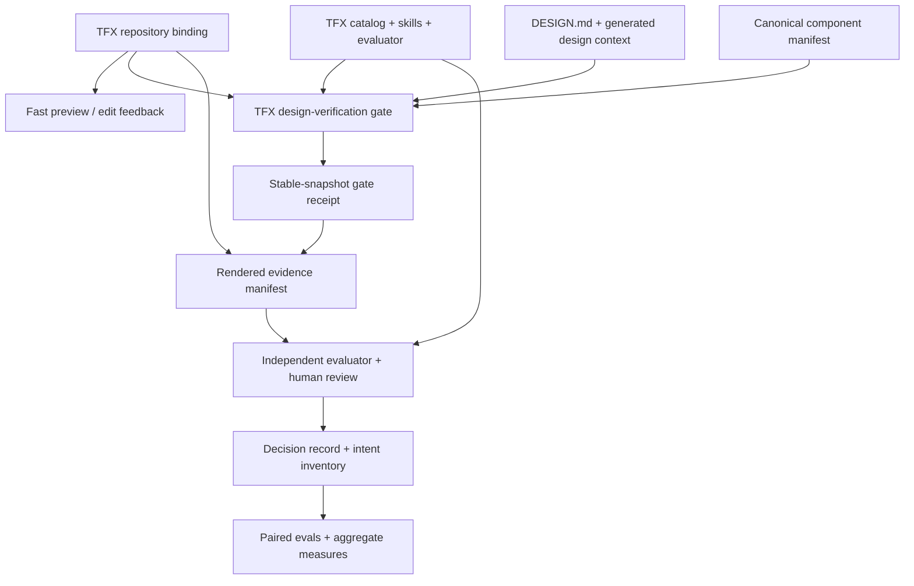
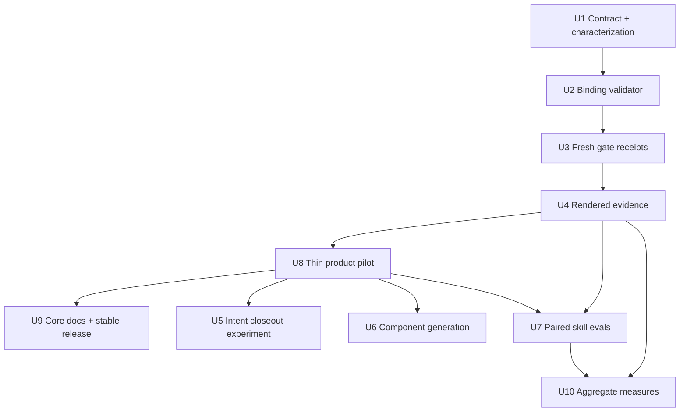

# Plan 074: Make the TFX design harness locally executable — repository binding, fresh gates, evidence receipts, and causal skill evals

> **Planning status:** proposed for design-harness / standards-team review. This
> document plans implementation; it does not approve a catalog change, install
> tooling in a product repository, publish telemetry, or deploy a preview.
>
> **Executor instructions:** implement this plan as the ordered, independently
> reviewable units below. Preserve each `U` identifier in commits, reviews, and
> follow-up plans. Do not silently widen the repository-binding contract. Stop at
> every named gate and record any deviation before continuing.
>
> **Drift check:** planned from `main` at `848c724` on 2026-07-27. Before execution,
> compare the in-scope paths and the live harness inventory with the baselines in
> “Current state.” Re-plan rather than forcing an outdated file map.

## Status

- **Priority:** P1 for U1–U4, U8, and U9; P2 for U5–U7 and U10
- **Effort:** XL, delivered in slices
- **Risk:** Medium — new execution and evidence boundaries, but no catalog change
- **Category:** harness architecture, verification, evaluation
- **Recommended owner:** TFX design harness / standards team
- **Consulted partner:** SLS team for shared learnings and interoperability feedback,
  not as an approval dependency
- **Planned on:** 2026-07-27

## Outcome

Make the existing TFX design harness reliably executable inside a TFX product
repository without turning product configuration into a second standard.

The target loop is:

1. The TFX catalog, skills, and evaluator remain the shared normative core.
2. A small, TFX-specific repository binding supplies facts the core cannot know:
   source roots, package scripts, and preview surfaces/states.
3. Fast feedback remains available while building; a separate verification gate
   produces a result tied to the current worktree.
4. Rendered evidence carries machine-readable provenance and an honest
   `unverified` state.
5. Session decisions and invalidated assumptions are routed into existing durable
   homes.
6. Skill changes are evaluated against a baseline over repeated runs, so the team
   can tell whether the harness caused an improvement and what it cost.

This preserves the strongest difference between TFX and SLS: TFX governs design at
the concept and outcome level across content, flow, layout, accessibility, visual
quality, and component use. The SLS work contributes useful execution mechanics; it
does not replace the TFX control catalog.

## Why this matters

The current harness is strong at defining and reviewing quality, but the last mile is
still assembled manually in each product session:

- the skill has to discover how to start and inspect the product;
- screenshots can outlive the code state they supposedly prove;
- the lightweight edit hook is easy to confuse with a green gate;
- component inventory is manually maintained;
- the decision record is durable prose, but its screenshots and command outcomes
  are not a typed evidence bundle;
- current evals show routing, compliance, and known output quality, but do not
  establish the causal effect of enabling the skill.

SLS has addressed several of those mechanics in its builder architecture:
repo-agnostic workflow, machine-readable repo facts, a fast foreground loop plus a
full gate, current-tree freshness, human render confirmation, intent capture, and
paired skill evals. Those are worth learning from.

The documentation is evidence of architectural intent, not proof that every SLS
mechanism works at scale. Several SLS ADRs/RFCs remain Proposed or Draft, its public
spec corpus is empty, published eval results are not available, and the public root
returned HTTP 500 during this review even though direct article routes worked. TFX
should therefore pilot the mechanics and measure them rather than copy the system.

## Current state

Live inventory at the planning commit:

| Surface | Current fact | Consequence |
|---|---|---|
| Normative source | `harness/standards/catalog.yaml`, 70 controls: 4 L0, 34 L1, 32 L2 | No new execution config may redefine a control, tier, threshold, waiver, or severity. |
| Enforcement | `validate.py --coverage`: 4 script / 18 partial / 30 manual / 18 evaluator | “Deterministic” and “actually wired” remain separate claims. |
| Static checks | 10 check scripts plus validator/check library | A new gate should compose owned checks, not replace them with another checker framework. |
| Edit feedback | `harness/hooks/design-hook.py` is reminder-only and always exits 0 | It is useful foreground feedback, not proof that verification is green. |
| Product context | optional human-authored `DESIGN.md` plus generated `.tfx/design.json` | Product parameters already have a source and precedence model; do not duplicate them. |
| Component context | `.tfx/component-manifest.json`, partial/complete coverage | The manifest is canonical but hand-maintained; generated-source freshness is not enforced. |
| Durable review | Markdown decision record plus `checks/audit-record.py` | The record has a manual evidence ledger, but no machine-readable evidence receipt. |
| Visual verification | 360/768/1280 widths, required states, journey/recovery, inventory checkoff, dark-mode proof | The procedure is sound; capture metadata and freshness are still manual. |
| Evaluation | routing cases, record audit, three golden tasks, evaluator-recall fixtures | There is no enabled-vs-baseline comparison, repeated-run variance, latency/token report, or aggregate harness measures report. |
| Adoption context | 11 skills and one evaluator; plugin-root `CLAUDE.md` is not guaranteed consumer-project context | Critical behavior must live in skills and checked artifacts, not only in plugin-root instructions. |
| Decision corpus | 8 real decision records plus the template | The deferred “build measures after at least five records” threshold has been met. |

## Requirements trace

| ID | Requirement | Success signal | Realised by |
|---|---|---|---|
| R1 | Preserve the TFX catalog as the only normative design source. | Repository config cannot define or override controls, tiers, waivers, severity, or evaluation policy. | U1, U2, U8, U9 |
| R2 | Give a TFX product repository one minimal, explicit place for execution facts. | A product can declare supported preview surfaces and named package scripts without editing the plugin. | U1, U2 |
| R3 | Separate fast iteration from an authoritative design-verification gate. | The edit profile stays quick/advisory; only a current verification receipt can support a verified design claim. | U3 |
| R4 | Invalidate verification after relevant worktree changes. | Editing tracked or untracked product input makes the previous green receipt stale. | U3, U4 |
| R5 | Make visual evidence portable, typed, and honest. | Every artifact records measured viewport, route/state, method, hashes, and `verified` or `unverified`; filenames alone prove nothing. | U4 |
| R6 | Test whether an intent-delta closeout captures material reasoning the current decision record misses without adding empty ceremony. | Existing records/live sessions demonstrate uncaptured intent before the optional closeout ships; when rows exist, a human confirms each row’s routing. | U5 |
| R7 | Reduce manual component-manifest drift without adding a peer source of truth. | Supported design-system exports generate the canonical manifest with source fingerprint and coverage declaration. | U6 |
| R8 | Measure whether a skill change caused improvement. | An identical task can be compared with/without the candidate skill over repeated runs, with evidence-backed assertions, variance, time, and token counts. | U7 |
| R9 | Add useful aggregate measures without surveillance infrastructure. | A local report answers named team questions from decision/eval artifacts and stores no prompt or personal-performance data. | U10 |
| R10 | Adopt incrementally across products and maturity levels. | Repositories with no binding continue in Manual mode; one product pilots the experimental binding and a second materially different product configures it before a stable compatibility claim. | U1, U2, U8, U9 |

## What to adopt, adapt, and leave out

| SLS lesson | TFX decision | Reason |
|---|---|---|
| Separate portable workflow, machine-readable repo facts, and local prose. | **Adapt.** Add one TFX-only repository binding for execution facts; keep `DESIGN.md`, `.tfx/design.json`, the component manifest, and the control catalog in their existing roles. | Preserves the useful separation without reviving the cancelled division-wide profiles/framework. |
| Fast foreground preview plus full background gate. | **Adopt.** Expose distinct edit and design-verification profiles with explicit status. | Improves speed without weakening the authoritative result. |
| A gate is invalid after the tree changes. | **Adopt.** Key receipts to a conservative worktree fingerprint. | Closes a real evidence-integrity gap. |
| Commit only after a green gate and human render confirmation. | **Adapt.** The skill may state that work is ready only after both; it never auto-commits. | Matches TFX human gates and user authority. |
| `to-intent` session closeout. | **Adapt.** Add an intent inventory to Phase 6 and route into existing TFX artifacts rather than create a generic decision-log system. | Captures reasoning without duplicating sources of truth. |
| Formal SDD spec lifecycle. | **Borrow the drift vocabulary only.** Keep the TFX sprint contract and plan gate. | A second spec system would add ceremony and conflict with the current loop. |
| Conformant / Missing / Beyond / Contradictory / Indeterminate findings. | **Adapt for evaluator directionality.** Keep the existing control verdict and evidence ledger; use these categories to explain drift, not replace pass/block tiers. | Helps teams decide whether code, intent, or standard should move. |
| Paired, repeated skill evals with variance and cost. | **Adopt.** Pilot against one existing golden task. | Establishes causal value and harmful regressions. |
| Central usage telemetry collector. | **Leave out.** Produce local aggregate reports from existing artifacts first. | Avoids privacy, infrastructure, and adoption scope before the questions prove valuable. |
| Same-artifact per-MR previews and structural prototype exclusion. | **Defer completely from v1.** V1 captures only a local preview tied to the current worktree; add external-preview identity only with a real provider and end-to-end freshness proof. | Strong idea, but product CI/platform ownership and stack-specific implementation sit outside this repo. |
| SLS token/component/composition rules. | **Do not import.** Only the ratchet can add a TFX control from TFX evidence. | SLS’s component and code rules are product-specific and narrower than the TFX design model. |
| Shared domain profiles or generic adapters. | **Reject.** The repository binding is intentionally TFX-specific, fixed-path, and non-composable. | The 2026-07-16 TFX decision explicitly cancelled division-level generalisation. |

## Key technical decisions

### D1 — A fixed TFX repository binding, not a generic adapter framework

Use a new fixed-path product file, `.tfx/repository.json`, with a versioned schema.
It contains execution facts only:

- product source roots;
- package-manager identity;
- names of existing `package.json` scripts for preview, fast check, and the
  design-verification gate;
- preview targets, routes, readiness signal, and deterministic state hooks;
- optional extra files that affect rendering.

It does **not** contain catalog entries, thresholds, wording rules, design tokens,
waiver policy, evaluator prompts, severity, domain profiles, overlays, or inheritance.
It references existing `.tfx/design.json` and `.tfx/component-manifest.json` by their
fixed conventions rather than copying their contents.

The first version supports package-script references rather than command text in the
binding. This prevents configuration-string injection, but it does **not** make a
package script shell-free or sandboxed: the script body is trusted repository code.
Before first execution, and whenever the binding or resolved script body changes, an
attended user reviews and authorises the repository revision, package manager,
script name/body digest, and required environment-variable names. The receipt stores
those facts (never secret values). Product scripts are disabled for untrusted forks
or revisions; pre-authorisation work is limited to canonical harness-owned checks.
The runner starts product scripts with a minimal, reviewed environment and makes no
claim that it contains malicious repository code. Supporting another execution
family is a later schema proposal backed by a real TFX consumer.

The verification-script declaration also names its product-engineering approver and
the product CI/workflow entry point it represents. A green receipt proves the
declared **TFX design-verification gate** ran; it does not claim the whole product is
release-ready. Any change to the script body, binding, or cited CI entry point
invalidates that approval.

Why a new file rather than `.tfx/config.json`: the existing config owns detector
noise suppression. Growing it into a flat catch-all would mix unrelated lifecycles
and contradict the component-manifest spike’s explicit warning against config
accretion.

### D2 — Existing manual mode remains valid

Absence of `.tfx/repository.json` is not an error in the first release. The skill
uses its current discovery/capture procedure and says “repository binding absent;
verification remains manual.” A configured repository receives stronger automation;
it does not change the standard applied to an unconfigured repository.

This creates progressive product-repository adoption without two standards:

| Mode | What is present | What can be claimed |
|---|---|---|
| Manual | No repository binding | Existing manual/static/evaluator evidence only |
| Configured | Valid binding | Known preview targets and named product checks |
| Evidenced | Configured + current gate/evidence receipts | Verification tied to the current tree |

Paired skill evaluation and aggregate measures are a separate
**harness-release-readiness** dimension owned by the design-harness / standards team,
not an adoption level product teams must reach.

### D3 — The verification receipt is keyed to a stable worktree snapshot

V1 favours false invalidation over false freshness. The fingerprint covers the
repository worktree except known dependency, build-output, VCS, and evidence-output
directories. It includes tracked modifications, staged changes, and untracked input;
it also records the harness/plugin version, catalog digest, repository binding,
`DESIGN.md`/`.tfx/design.json`, component manifest, package manifest, and lockfile.

The gate fingerprints immediately before its first check and immediately after its
last check. It may emit `passed` only when both fingerprints are identical. A
concurrent or configured-script mutation produces no green receipt and requires a
rerun. Optimising to a narrower dependency graph or an immutable snapshot is deferred
until pilot evidence shows the conservative worktree approach is materially
disruptive.

### D4 — Execution, evidence, and freshness are separate axes

The schemas must not overload one status field:

| Axis | Values | Stored or derived by |
|---|---|---|
| Execution outcome | `passed`, `failed`, `tool_error`, `cancelled` | gate receipt |
| Evidence result | `verified`, `unverified` | evidence entry and bundle roll-up |
| Freshness | `current`, `stale` | derived whenever a receipt/evidence bundle is consumed |

Harness-owned checks keep their structured finding/tool-error distinction. For a v1
product package script, launch/preflight failure, timeout, cancellation, or malformed
required envelope is `tool_error`/`cancelled`; a non-zero script exit is
`failed` with `failure_kind: product_gate`, not automatically a TFX control finding.
An optional structured product envelope may classify more precisely after its schema
is ratified. Tool failure never becomes a design finding, and missing evidence never
becomes a pass.

| Condition | Operator-facing recovery |
|---|---|
| `failed` | Address the named check/product-gate failure, then rerun the complete verification gate. |
| `tool_error` | Repair configuration, dependency, or tooling; rerun from the failed preflight/gate step. |
| `cancelled` | No green receipt; resume only by starting a new verification run. |
| `unverified` | Recapture, provide a permitted human attestation, or record “Cannot verify”; work is not ready. |
| `stale` | Re-run the gate and every dependent capture/review against the new fingerprint. |

### D5 — Evidence is a machine-readable companion, not a replacement record

The Markdown decision record stays the human-readable durable artifact. A JSON
evidence manifest records capture and gate facts and is linked from the record. The
evaluator still independently inventories the implemented/source-rendered surface;
the supplied manifest is evidence to reconcile, not the definition of scope.

Raw evidence uses synthetic/non-production data by default and stays in a gitignored,
ephemeral `.tfx/evidence/` directory. A separate human-approved export may become a
durable/shareable bundle only after path containment, file type/size, sensitive-data,
and redaction checks pass. The decision record links the sanitised bundle digest when
one is exported; otherwise it records the local manifest digest, retention outcome,
and any permitted human attestation. Production/student/teacher data is never
captured merely to satisfy the harness—if a safe state cannot be produced, the result
is `unverified`.

After evaluator reconciliation, an attended render review presents evidence in
journey order with stale/unverified items first. The reviewer chooses `Approve`,
`Adjust`, or `Cannot verify`; the record stores reviewer, time, and manifest digest.
`Adjust` returns to implementation and invalidates the old review; `Cannot verify`
leaves the run pending. Unattended runs cannot self-approve.

### D6 — Intent routing uses existing governance paths

The closeout inventory routes:

| Intent class | Destination |
|---|---|
| Chosen/rejected approach and tradeoff | Current decision record |
| Product parameter | Human `DESIGN.md`, then regenerate `.tfx/design.json` |
| Component fact | Component source / canonical manifest workflow |
| Possible new control or anti-pattern | Ratchet proposal, pending design-lead approval |
| Harness friction | Existing GitHub issue workflow through `feedback` |
| Product work | Product backlog/spec owned by that team |
| Pending ruling or parked idea | Current decision record until an owner/destination is named |

The agent presents the inventory for human confirmation. In unattended mode it may
draft the inventory but must leave routing `pending`, not self-approve it.

### D7 — Evals isolate one candidate change against a frozen baseline

The paired-eval layer wraps, rather than replaces, routing, record audit, golden
tasks, and evaluator recall. An eval case uses the same brief and fixture for:

- baseline behavior: an explicitly pinned prior version of the same skill;
- candidate behavior;
- repeated runs sufficient to expose variance.

Assertions must cite captured evidence. Results report pass-rate delta, mean and
standard deviation for time and token counts, nondiscriminating assertions, and
candidate regressions. Pricing is derived when reporting; immutable token counts are
the stored fact. A plugin-disabled arm is allowed only as a separately labelled
whole-plugin experiment; it cannot support a claim about one skill change.

Each arm and repetition runs from the same fixture commit in a fresh disposable
workspace with a unique artifact directory. The runner pins the model/backend and
unchanged plugin/evaluator versions, supplies predeclared operator-proxy choices for
human gates, randomises or interleaves arm order, prevents cross-run writes, and
records timeout/cancellation plus the backend’s authoritative duration/token fields.
Unavailable usage data stays unavailable rather than estimated.

## High-level design

Directional design only; exact data structures belong in U1/U4 specs and their
schemas.

The prose and unit requirements govern if this diagram ever disagrees with them.

## Scope

### In scope

- a TFX-only, fixed-path repository binding and validator;
- fast versus design-verification gate profiles;
- current-tree gate freshness;
- typed rendered-evidence manifests;
- decision-record/evaluator integration;
- an evidence-gated, optional intent-delta closeout experiment;
- generated component-manifest input and freshness;
- paired skill evals and local aggregate measures;
- one experimental product-repository pilot and a second configured consumer before
  stable compatibility;
- documentation, migration guidance, and release truth.

### Out of scope

- adding, removing, or changing a TFX catalog control;
- a cross-domain profile system, generic adapter SDK, overlay/merge semantics, or
  runtime-selectable standards;
- arbitrary shell commands from product config;
- automatic commit, push, merge request, preview deployment, or production deploy;
- a central telemetry service, database, prompt capture, or individual performance
  reporting;
- owning Storybook, visual-regression, or preview infrastructure for product teams;
- consuming an external preview in v1;
- requiring build-time prototype flags in every product;
- importing SLS tokens, component rules, or code-level composition rules;
- replacing the Markdown decision record or independent evaluator;
- generating a standalone annotated HTML critique report in this plan. U4 creates the
  evidence foundation; a follow-up can implement the existing portable-report request
  without coupling it to gate delivery.

## Implementation dependency graph

U8 is the keep/revise/stop gate for the core vertical slice. U5–U7 and U10 do not
start until that pilot accepts the premise. U9 may publish the experimental core
after U8, but stable schema compatibility requires a second materially different
configured consumer. After U8, U5–U7 can proceed independently; U10 follows U7.
Shared-file edits in the design skill, evaluator, decision template, onboarding, and
check documentation must still land serially.

## Implementation units

### U1 — Characterise the current loop and ratify the repository-binding contract

- **Priority:** P1
- **Requirements:** R1, R2, R10
- **Depends on:** none
- **Files:**
  - add `harness/docs/spikes/repository-binding/SPEC.md`
  - add `harness/repository/schema.json`
  - add `harness/docs/templates/REPOSITORY.json`
  - reference `harness/docs/decisions/dxd-harvest.md`
  - reference `harness/docs/DESIGN-CONTEXT.md`
  - reference `harness/docs/spikes/component-manifest/SPEC.md`
  - reference `harness/docs/spikes/component-manifest/RECOMMENDATIONS.md`

**Deliverable**

A reviewed experimental schema and behavior spec for `.tfx/repository.json`, grounded
in live product-repository examples. It must explicitly record the D1 boundaries and
the Manual/Configured/Evidenced modes. A stable schema compatibility promise is not
made until U9 configures a second materially different consumer.

**Approach**

1. Capture the current behavior of `detect.py`, the edit hook, built checks, manual
   screenshot procedure, component-manifest handling, evaluator dispatch, and record
   audit before introducing shared resolution code.
2. Select the first real TFX pilot before ratifying fields. Baseline the current
   manual workflow: discovery/setup time, recurring command/route discovery,
   verification duration, evidence-label completeness, capture fallbacks, and
   operator willingness to repeat the workflow.
3. Sample a second materially different real TFX consumer’s execution facts before
   calling the schema stable. If it cannot be configured during this plan, keep the
   schema explicitly experimental and make no compatibility promise.
4. Keep the v1 schema flat, fixed-path, and non-composable. Define provenance and
   precedence for every field.
5. Define the trust boundary from D1: the binding contains no command text, but a
   resolved package script is trusted executable repository code. Specify attended
   authorisation, digest invalidation, minimal environment, and untrusted-fork
   prohibition.
6. Restrict v1 preview targets to loopback/local origins tied to the current
   worktree. State hooks are declarative route/query/state identifiers, never script
   bodies. Readiness probes do not follow cross-origin redirects or carry
   credentials.
7. Document how binding absence, an unknown schema version, a missing package script,
   and a configured-but-unreachable preview surface behave.

**Test scenarios**

| Scenario | Expected outcome |
|---|---|
| No `.tfx/repository.json` | Existing manual workflow remains available; no automation claim is made. |
| Minimal valid TFX binding | Schema accepts roots, one loopback preview target, and named fast/verification package scripts; product identity remains in existing product context. |
| File tries to define `controls`, `tiers`, `waivers`, `thresholds`, or evaluator policy | Schema rejects it as outside the contract. |
| File contains raw command text, command substitution, traversal, or an escaping symlink | Rejected before execution. |
| File introduces profiles, inheritance, or overlays | Rejected as unsupported, not silently merged. |
| Package script exists but has not been human-authorised at its current digest | Harness-owned preflight may run; product script remains blocked. |
| Preview target is remote, redirects cross-origin, or embeds an executable state hook | Rejected from the experimental schema. |

**Verification outcome**

The design-harness/standards team can answer, from the spec alone, what the file is
allowed to control and why it cannot become another standard.

**Gate**

Design-harness/standards-team approval of the **experimental** contract is required
before U2. SLS feedback is invited on interoperability and missing repo facts, but
SLS does not approve the TFX source-of-truth boundary. The gate also records
pre-agreed U8 thresholds relative to the U1 baseline:

- initial binding setup takes no more than 45 minutes and needs no product-specific
  TFX-core edit;
- repeat runs need no manual command, route, viewport, or state-label discovery;
- gate orchestration adds no more than 15% over the product’s baseline verification
  duration, excluding checks that did not exist in the baseline;
- 100% of required evidence entries carry measured provenance and zero stale or
  mislabelled artifact is accepted;
- both the pilot designer and product engineer say they would use the Evidenced mode
  again, with requested revisions recorded.

### U2 — Build the binding resolver and validator

- **Priority:** P1
- **Requirements:** R1, R2, R10
- **Depends on:** U1
- **Files:**
  - add `harness/checks/repository-config.py`
  - add focused fixtures under `harness/checks/fixtures/repository-config/`
  - update `harness/checks/README.md`
  - update `harness/.claude/skills/start/SKILL.md`
  - update `harness/.claude/skills/setup/SKILL.md`
  - update `harness/docs/ONBOARDING.md`

**Deliverable**

A side-effect-free resolver that returns a stable structured representation of the
repository binding and clearly distinguishes `absent`, `valid`, and `invalid`.

**Approach**

- Follow the existing check convention: embedded `--self-test`, stable human and
  structured output, canonical path containment, and explicit tool-error behavior.
- Resolve named package scripts from `package.json`; never pass binding text through
  a shell. Treat the resolved script as trusted executable repository code and return
  its body digest, package-manager version, approval status, cited CI entry point,
  and required environment-variable names without values.
- Keep detector ignores separate. The resolver may read `.tfx/config.json` only to
  explain that it is a different artifact; it does not merge the files.
- Do not mark the binding validator or a local script as catalog enforcement merely
  because it exists. Enforcement metadata, implementation, and actual wiring must
  continue to agree.
- Update onboarding as repository adoption, separate from personal dependency setup
  and first-run orientation.

**Test scenarios**

| Scenario | Expected outcome |
|---|---|
| Valid file and all named scripts exist | Stable resolved JSON and clean human output. |
| Named script is absent from `package.json` | Invalid binding with an actionable path/script finding. |
| Named script body, binding, lockfile, or cited CI entry changes after approval | Prior authorisation is stale; product execution is blocked until re-approved. |
| Unsupported package manager or schema version | Explicit unsupported result; no guessed command. |
| `cwd`/root traverses or resolves outside the repo | Rejected, including symlink escapes and nested traversal. |
| Untrusted fork/revision requests product-script execution | Refused; only canonical harness-owned preflight is eligible. |
| Malformed config plus a real design finding | Tool/config error remains distinguishable from product findings. |
| Existing detector ignore names an L0 control | Existing L0 invariant still wins; the binding cannot affect it. |
| Legacy repository with no file | Resolver returns `absent` and the design skill follows manual mode. |

**Verification outcome**

The same fixture produces equivalent human and structured conclusions; adversarial
path/command cases fail safely; no existing check behavior changes.

### U3 — Add fast and design-verification gates with stable-snapshot receipts

- **Priority:** P1
- **Requirements:** R3, R4
- **Depends on:** U2
- **Files:**
  - add `harness/checks/gate.py`
  - add `harness/gate/receipt.schema.json`
  - add gate fixtures under `harness/checks/fixtures/gate/`
  - update `harness/.claude/skills/design/SKILL.md`
  - update `harness/.claude/skills/design/verify.md`
  - update `harness/hooks/design-hook.py` only to clarify the handoff, not to make it blocking
  - update `harness/checks/README.md`

**Deliverable**

One orchestrator over existing owned checks and declared product package scripts,
with:

- `edit` profile: quick, advisory, no verification receipt;
- `verify` profile: authoritative local TFX design-verification gate;
- `ci` entry mode: the same design-verification semantics with machine output.

Only successful `verify`/`ci` runs produce a green receipt. The receipt records the
pre-run and post-run worktree/catalog/config fingerprints, component results,
product-script results, script/approval digests, harness version, entry mode,
duration, execution outcome, and failure kind. It does not claim whole-product
release readiness.

**Approach**

- Compose the current checks; do not move their rule semantics into `gate.py`.
- Apply D4’s separate axes and v1 product-script failure contract. A non-zero product
  verification script fails the gate but is not invented into a TFX control finding.
- Fingerprint conservatively per D3 and exclude the receipt/evidence output itself so
  writing a receipt does not invalidate it.
- Compare fingerprints captured immediately before the first check and after the last
  check. A mismatch produces no green receipt, including when a configured script or
  concurrent process mutated the tree.
- Recompute freshness whenever a receipt is consumed. A receipt never declares
  itself current.
- Keep the existing hook low-noise and non-blocking. Its message should say which
  profile ran and that edit feedback is not the verification gate.

**Test scenarios**

| Scenario | Expected outcome |
|---|---|
| Verification gate passes; pre/post fingerprints match | Green receipt validates against current tree. |
| A configured script mutates a tracked or untracked input during the gate | Pre/post mismatch; no green receipt and a rerun is required. |
| A tracked product file changes afterward | Receipt becomes `stale`. |
| An untracked product input appears afterward | Receipt becomes `stale`. |
| Only `.tfx/evidence/` output changes | Receipt remains current. |
| One checker reports a control violation | Overall `failed`; finding retains owner/control/source. |
| Harness checker fails to launch/crashes, or product script times out | `tool_error`, not a design finding. |
| Authorised product script exits non-zero without a structured result | `failed` with `failure_kind: product_gate`; no fabricated control id. |
| Product script is cancelled | `cancelled`; no receipt can be green. |
| Edit profile passes | Helpful result but no authoritative green receipt. |
| Repository binding is absent | Current manual/check procedure remains; gate does not invent product commands. |
| Binding attempts command text or shell expansion | Rejected by U2 before gate execution. |

**Verification outcome**

A negative-control fixture first demonstrates that a known violation fails. A clean
fixture then passes. Mutating the clean fixture after receipt creation demonstrably
invalidates the receipt.

### U4 — Add typed rendered-evidence manifests and reconcile them independently

- **Priority:** P1
- **Requirements:** R4, R5
- **Depends on:** U3
- **Files:**
  - add `harness/evidence/schema.json`
  - add `harness/docs/templates/EVIDENCE.json`
  - add `harness/checks/evidence-manifest.py`
  - update `harness/.claude/skills/design/verify.md`
  - update `harness/.claude/agents/evaluator.md`
  - update `harness/docs/decisions/TEMPLATE.md`
  - update `harness/checks/audit-record.py`

**Deliverable**

A per-run evidence bundle at a fixed product-repository location such as
`.tfx/evidence/<run-id>/manifest.json`. The schema records:

- run and current-tree receipt identity;
- artifact path and content hash;
- preview target, route, declared UI state, theme, and capture method;
- measured viewport width/height, not a filename inference;
- capture time and readiness signal;
- result `verified` or `unverified` with a reason;
- journey step/recovery-path relationship where relevant.

The decision record links the manifest and still contains the full evaluator verdict.

**Approach**

- Make the evidence manifest authoritative only for provenance. It does not decide
  whether the UI passes a control.
- Resolve every artifact as a normalised relative path beneath its own
  `.tfx/evidence/<run-id>/` bundle. Reject absolute paths, traversal, escaping
  symlinks, non-regular files, unsupported media types, and files over the
  ratified size limit before opening or hashing them.
- Capture only the local loopback preview tied to the receipt’s worktree in v1.
  Remote/external preview evidence remains `unverified` until a later schema can
  prove source/build identity end to end.
- Enforce D5’s evidence policy: synthetic/non-production data, gitignored raw
  bundles, redacted logs/metadata, and explicit human approval for a sanitised
  durable export. Sensitive data is never persisted just to make a run pass.
- Require the evaluator to reconcile submitted evidence with its own source/DOM
  inventory and explicitly list unrepresented components, controls, and states.
- Add drift categories to evaluator explanations where useful:
  `conformant`, `missing`, `beyond_intent`, `contradictory`, `indeterminate`.
  These supplement, not replace, TFX blocker/severity/control verdicts.
- Introduce a template/record format marker or another explicit compatibility rule.
  Historical records must remain auditable without fabricated evidence; new records
  use the evidence manifest. Tightening `audit-record.py` must be tested over the
  complete real decision-record corpus, not only synthetic fixtures.
- If browser capture fails, write `unverified` and retain the reason. Never infer a
  visual pass from source code.
- After evaluator reconciliation, run D5’s structured human render review. Present
  journey order with stale/unverified items first; `Approve` records reviewer/time/
  manifest digest, `Adjust` returns to implementation and invalidates the review,
  and `Cannot verify` leaves the run pending.

**Test scenarios**

| Scenario | Expected outcome |
|---|---|
| Artifact says width 768 but measured metadata is 360 | Manifest fails validation; filename cannot rescue it. |
| Artifact file changes after manifest creation | Hash mismatch makes the evidence stale. |
| Artifact path is absolute, traverses, escapes by symlink, is non-regular, or exceeds the size limit | Rejected before file contents are read. |
| Gate receipt fingerprint no longer matches | Every dependent artifact is stale. |
| Loading/success/error required but one state is absent | Missing state remains `unverified` and visible to evaluator. |
| Browser capture fails after fallbacks | Honest `unverified` entry with method/error, no pass. |
| Preview contains real student/teacher data with no approved redaction path | Capture is blocked or discarded and recorded `unverified`; sensitive content is not persisted. |
| Supplied screenshots omit an interactive control found in source/DOM inventory | Evaluator reports coverage gap independently. |
| Human selects `Adjust` after render review | Review state is invalidated, work returns to implementation, and gate/evidence/evaluator rerun. |
| Human selects `Cannot verify` or run is unattended | No ready claim; review remains pending with reason. |
| A legacy decision record is audited | Remains valid under the documented compatibility rule. |
| A new-format record omits its evidence manifest or full evaluator verdict | Record audit fails. |

**Verification outcome**

Schema fixtures, checker self-tests, a real fresh capture, a deliberately stale
capture, and the full existing record corpus all produce their expected outcomes.

### U5 — Test and, only if earned, add an intent-delta closeout

- **Priority:** P2
- **Requirements:** R6
- **Depends on:** U8 keep/revise decision
- **Files:**
  - add `harness/.claude/skills/design/converge.md`
  - update `harness/.claude/skills/design/SKILL.md`
  - update `harness/docs/decisions/TEMPLATE.md`
  - update `harness/checks/audit-record.py`
  - update `harness/docs/harness-feedback.md` only if routing instructions need clarification

**Deliverable and evidence gate**

First inspect at least three real completed records/session transcripts for material
reasoning that the current chosen/rejected/tradeoff/ratchet sections lost. If no
consequential missed item is found, record the rejected hypothesis in the U8 pilot
review and stop U5 without adding workflow ceremony.

If the evidence gate passes, add a triggered Phase 6 **intent delta** inventory with
these classes:

- decided;
- rejected alternative;
- invalidated assumption;
- pending ruling;
- agreed follow-up;
- new term;
- parked.

Each row has a concise item, rationale/evidence, destination, owner, gate, and routing
status. Empty inventories do not trigger a confirmation step. When rows exist, the
human can `Confirm all`, `Adjust a row`, `Park a row`, or `Leave pending`; confirmed
rows may route without silently approving disputed rows. The diff and conversation
are inputs; the closeout synthesises them rather than re-interviewing the user.

**Approach**

- Put the detailed procedure in `converge.md` and keep the design skill’s main route
  concise.
- Route only through D6’s existing destinations.
- A possible catalog addition remains a proposal until the existing ratchet and named
  design-lead approval complete.
- Do not create a new Markdown feedback backlog, generic decision log, or glossary
  merely because SLS has one.
- In unattended mode, store only non-empty proposed rows with `pending human
  confirmation`.

**Test scenarios**

| Scenario | Expected outcome |
|---|---|
| Session chose A and rejected B for a named tradeoff | Both survive in the decision record. |
| Session disproved a product assumption | `invalidated assumption` is explicit and routed to an owner. |
| Agent notices a possible new control | Ratchet proposal is suggested; catalog remains untouched. |
| Harness friction is found | Routed to the existing issue-backed feedback workflow, with dedup/dry-run semantics. |
| Item has no owner or durable destination | Stays pending/parked; no new generic file is invented. |
| User adjusts one row and confirms another | Confirmed row routes; disputed row remains pending with its revision. |
| Session produces no intent beyond the existing record | No extra confirmation or empty table is added. |
| Unattended run reaches closeout | Inventory is draft/pending, never self-confirmed. |
| New audit assertion is introduced | Synthetic fixtures and every real record are checked before merge. |

**Verification outcome**

The evidence gate is recorded. If it passes, one attended rehearsal (including a
partial confirmation) and one unattended rehearsal produce correctly different
states, with no direct catalog mutation or duplicate feedback store.

### U6 — Generate and freshness-check the canonical component manifest

- **Priority:** P2
- **Requirements:** R7
- **Depends on:** U8 keep/revise decision
- **Files:**
  - add `harness/scripts/generate-component-manifest.py`
  - add generator fixtures under `harness/scripts/fixtures/component-manifest/`
  - update `harness/checks/component-manifest.py`
  - update `harness/docs/spikes/component-manifest/SPEC.md`
  - update `harness/docs/spikes/component-manifest/RECOMMENDATIONS.md`
  - update `harness/.claude/skills/design/SKILL.md`
  - update `harness/scripts/README.md`

**Deliverable**

A deterministic generator that accepts one ratified design-system export from the
pilot product and emits `.tfx/component-manifest.json` as the sole canonical manifest.
The output records generator version, source path/type, source fingerprint,
generated time, and `partial|complete` coverage.

**Approach**

- Start with the export already available in the pilot (for example, its supported
  Storybook index export). Do not create a multi-provider extraction framework.
- Preserve current component fields and partial/complete semantics.
- Add source-fingerprint freshness checking. A stale generated manifest fails open to
  explicit manual review; it never masquerades as a complete mechanical diff.
- Keep deterministic output ordering. If the source fingerprint and canonical
  component content are unchanged, preserve `generated_at` and do not rewrite the
  file; no-op generation must be byte-identical and must not stale a gate receipt.
- Bring `component-manifest.py` output into the canonical check formatting contract
  while preserving its existing rule semantics.

**Test scenarios**

| Scenario | Expected outcome |
|---|---|
| Same source export is generated twice | Generator performs a byte-identical no-op, including a preserved `generated_at`. |
| Source export changes after generation | Manifest is reported stale. |
| Partial manifest | Useful entries inform design/evaluator; import diff remains off. |
| Complete manifest with unknown product import | CMP-1 finding appears. |
| Duplicate/ambiguous component entry | Generator rejects it with source evidence. |
| Unsupported export version | Explicit unsupported/tool error; no partial guessed output. |
| Generated output is manually edited | Source/output fingerprint mismatch is visible. |

**Verification outcome**

The pilot product can regenerate its canonical manifest from its real design-system
export, and a deliberate export change invalidates the old result.

### U7 — Add isolated paired skill evals

- **Priority:** P2
- **Requirements:** R8
- **Depends on:** U8 keep/revise decision
- **Files:**
  - add `harness/evals/ab/README.md`
  - add `harness/evals/ab/cases.yaml`
  - add `harness/evals/ab/run-ab.py`
  - add `harness/evals/ab/report.py`
  - update `harness/evals/score.py` only if shared result parsing is genuinely identical
  - update `harness/evals/README.md`

**Deliverable**

A paired skill report for one existing golden task, comparing a pinned prior version
of the same skill with the candidate over repeated, isolated runs. A separately
labelled plugin-disabled experiment may measure the whole plugin but cannot support a
skill-change claim.

**Approach**

- Reuse existing golden assertions and evaluator-recall ground truth where possible.
- Keep routing, process compliance, output quality, and paired causality as separate
  layers; one green layer cannot stand in for another.
- Implement D7’s isolation contract: same fixture commit, disposable workspace per
  arm/repetition, unique output path, pinned model/backend and unchanged
  plugin/evaluator, predeclared operator-proxy decisions, interleaved arm order, no
  shared writes, explicit timeout/cancellation.
- Require captured evidence for every assertion. An unverifiable assertion fails or
  is marked indeterminate according to its declared policy.
- Use held-out near-miss prompts for trigger evals; do not leak expected answers into
  candidate runs.
- Store immutable duration/token facts and derive money at report time from an
  explicit price table/version.
- Run on relevant changes, not a nightly timer. Keep the pilot small enough that a
  reviewer can inspect every result.

**Test scenarios**

| Scenario | Expected outcome |
|---|---|
| Candidate and baseline both pass an assertion | Report labels it nondiscriminating rather than crediting the skill. |
| Candidate passes and baseline fails | Positive skill delta with cited evidence. |
| Candidate fails and baseline passes | Harmful regression is prominent even if aggregate score rises. |
| Repeated results vary | Mean, standard deviation, and raw-run links expose variance. |
| Baseline and candidate attempt to write the same artifact path | Runner rejects the setup before either arm executes. |
| Plugin-disabled arm is compared with a candidate skill | Report labels it whole-plugin effect and refuses a single-skill causal claim. |
| A result claims success without evidence | Assertion fails/indeterminate per policy. |
| Token count is present but price table changes | Stored run remains unchanged; derived cost updates transparently. |
| Evaluator skill changes | Existing recall gate remains separately required. |

**Verification outcome**

The report can answer “better, worse, or similar?” for the pilot task with outcome,
variance, harmful-regression, time, and token evidence—not a single curated demo.

### U8 — Run the thin vertical pilot before building add-ons

- **Priority:** P1
- **Requirements:** R1, R10 and integration coverage for R2–R5
- **Depends on:** U4
- **Files:**
  - add one pilot review under `harness/docs/reviews/`
  - add `.tfx/repository.json` and any product-owned wiring in the pilot product
    repository, not this harness repo

**Deliverable**

One real TFX product reaches Evidenced mode with the explicitly experimental schema.
The pilot compares the U1 baseline with the configured run and makes a
keep/revise/stop decision before U5–U7 or U10 begin. The review records:

- setup time and fields the binding could/could not express;
- fast-loop and design-verification duration/overhead;
- stale-receipt negative control;
- evidence completeness and manual fallback;
- human render-review outcome and revision loop;
- product-team and design-reviewer feedback;
- result against every U1 threshold;
- fields or features deliberately rejected from v1.

**Approach**

- Choose a product with an accessible local preview, existing package scripts, and a
  representative async/interactive flow. Do not select solely for an easy pass.
- Add the product binding in the product repository; do not fork or patch TFX core
  for product-specific facts.
- Verify a second unconfigured repository still follows Manual mode.
- Exercise script authorisation, pre/post fingerprint equality, stale invalidation,
  safe evidence handling, independent evaluator reconciliation, and structured human
  render review end to end.
- If a U1 keep threshold fails, choose `revise` with a bounded contract change or
  `stop`; do not start P2 add-ons to justify sunk work.

**Test scenarios**

| Scenario | Expected outcome |
|---|---|
| Pilot changes product code after a green gate | Previous receipt/evidence becomes stale; new gate required. |
| Pilot capture cannot reach one state | Run remains `unverified`; reviewer sees the gap. |
| Product needs a new repo fact not in v1 | Record the need; do not smuggle it through an unrelated field. |
| Second product has no binding | Existing workflow still works and makes no automated-gate claim. |
| Configured script mutates the tree mid-gate | Pre/post mismatch prevents a green receipt. |
| Evidence contains unsafe paths or sensitive data | Bundle is rejected/discarded; run stays unverified. |
| Pilot exceeds setup/overhead threshold or operators would not reuse it | `revise` or `stop`; no add-on work begins. |

**Verification outcome**

The pilot supplies a sanitised shareable review artifact and an evidence-backed
keep/revise/stop decision reviewed by the design-harness/standards team.

### U9 — Document the core, configure a second consumer, and make the release claim

- **Priority:** P1
- **Requirements:** R1, R10
- **Depends on:** U8 `keep` or accepted `revise`
- **Files:**
  - update `harness/README.md`
  - update `harness/docs/ONBOARDING.md`
  - add `harness/docs/REPOSITORY-BINDING.md`
  - update `harness/docs/SYNC.md`
  - update `harness/checks/README.md`
  - update `content/harness/tools.mdx`
  - update `harness/.claude-plugin/plugin.json`
  - update `harness/CHANGELOG.md`
  - add a second-consumer review under `harness/docs/reviews/`

**Deliverable**

Current-facing adoption documentation and an experimental or stable release claim
that matches the evidence:

- If only one configured consumer exists, publish the feature as experimental and
  make no compatibility promise.
- A stable schema claim requires a second materially different real TFX product to
  reach Configured mode without a product-specific TFX-core edit. The second product
  may remain Manual for evidence capture if it cannot yet complete a representative
  flow, but its execution facts must exercise the schema.

**Approach**

- Treat SLS as a peer review partner: share the contract and pilot findings, identify
  vocabulary or evidence formats worth aligning, and preserve separate governance.
- Update public/current-facing docs from source where possible and add parity guards
  for any fact that must be duplicated.
- Do not depend on `harness/CLAUDE.md` loading in consumer projects; every required
  behavior must be reachable from the plugin skill, schema, or checked onboarding
  artifact.
- State narrowly what a green receipt proves: current TFX design verification, not
  whole-product release readiness.

**Test scenarios**

| Scenario | Expected outcome |
|---|---|
| Second consumer needs profiles, inheritance, raw command text, or policy fields | Stable claim stops; re-plan rather than widening silently. |
| Only one product is configured | Experimental docs/version remain truthful. |
| Current-facing docs state counts/paths/claims | Parity validators and site tests agree with live sources. |
| Plugin is installed in a clean consumer | Required instructions resolve without plugin-root `CLAUDE.md`. |
| Release candidate | Existing checker self-tests, full record corpus, existing eval layers, plugin validation, website tests, and build remain green. |

**Verification outcome**

The published maturity/compatibility claim is exactly supported by one or two real
consumer configurations, with no product-specific fork of the TFX core.

### U10 — Add the first local aggregate measures report

- **Priority:** P2
- **Requirements:** R9
- **Depends on:** U4 and U7
- **Files:**
  - add `harness/evals/measures.py`
  - update `harness/evals/README.md`

**Deliverable**

A local TFX measures report derived from decision records and eval artifacts. It
starts with questions and owners, not a dashboard:

| Question | Initial measure | Decision it informs |
|---|---|---|
| Are teams completing the full loop? | records with approved plan, current receipt, evidence manifest, evaluator verdict, and render-review outcome | which phase needs simplification/support |
| Where does verification stall? | `tool_error`, `unverified`, `stale`, `cancelled`, and rerun counts by stage | which binding/capture mechanism to improve |
| Is the harness finding material issues without noise? | finding category/severity, waiver rate, invented-blocker rate, re-review outcome | evaluator/check calibration |
| Does the skill improve outcomes? | paired pass-rate delta and harmful-regression count | whether to release the skill change |
| What does improvement cost? | duration and token counts, mean ± standard deviation | whether benefit justifies cost or a cheaper profile is needed |

**Approach**

- Treat product adoption measures and harness-release evals as separate dimensions.
- Do not store prompt text, conversation content, user identity, secret values, or
  individual rankings.
- Store immutable token counts and durations; derive price at report time.
- Identify incomplete legacy records honestly instead of fabricating zeroes.

**Test scenarios**

| Scenario | Expected outcome |
|---|---|
| Report reads the current eight-record corpus | Produces aggregates and explicit unavailable fields without prompt/personal data. |
| New receipt uses all three D4 axes | Report counts outcome, evidence, and freshness separately. |
| A record has no evidence bundle because it predates U4 | Classified legacy/unavailable, not failed or zero. |
| Price table changes | Historical token facts stay fixed; derived cost changes transparently. |

**Verification outcome**

The standards team can name a decision each metric supports and can remove any metric
that does not change a team decision.

## System-wide impact

| Surface | Change | Failure mode to guard |
|---|---|---|
| Standards catalog | Read and fingerprint only | Binding accidentally becomes a control override or “local standard.” |
| Design skill | Loads binding and evidence; may later load a triggered intent delta | Main skill becomes bloated or critical behavior lives only in plugin-root prose. |
| Static checkers | Composed by gate, semantics remain owned | Gate swallows tool errors, changes output contracts, or implies full-control coverage. |
| Product repository | Gains optional `.tfx/repository.json` and evidence output | Untrusted command execution, path escape, stale config, or generated-output churn. |
| Preview/browser layer | Uses declared routes/states/readiness | Filename viewport lies, inaccessible states, PII in screenshots, or local-only false confidence. |
| Evaluator | Reconciles typed evidence and adds drift direction | Executor defines its own scope/verdict or submitted evidence hides uncovered controls. |
| Decision records | Link evidence and capture intent | New audit rules retroactively invalidate or fabricate legacy evidence. |
| Component manifest | Can be generated and freshness-checked | Storybook/export becomes a competing source or partial data triggers a noisy full diff. |
| Evals | Adds isolated baseline/candidate repetition and a separate measures report | Ground-truth leakage, cross-run contamination, nondiscriminating tests, cost explosion, or a vanity score. |
| Docs/site | Teaches adoption and actual enforcement | Hand-maintained counts/claims drift from code and schemas. |

## Risks and mitigations

| Risk | Impact | Mitigation / stop rule |
|---|---|---|
| Repository binding recreates the cancelled generic framework. | Architectural and organisational regression. | Fixed TFX path/schema, no profiles/overlays/inheritance/domains, no cross-domain promise. Stop if implementation needs those concepts. |
| Config becomes a second rulebook. | Products silently weaken shared standards. | Reject control/policy fields; catalog and waiver invariants remain authoritative. |
| Config-driven command execution is exploitable. | Trusted repository script can execute arbitrary code or expose credentials. | No command text in binding; attended authorisation of exact revision/script digest; minimal environment; no untrusted-fork execution; explicit non-sandbox threat model. |
| A green receipt gives false confidence. | Stale, partial, or concurrently mutated work is presented as verified. | Conservative whole-worktree fingerprint, equal pre/post fingerprints, current approval digests, separate execution/evidence/freshness axes. |
| Gate duplicates or changes checker semantics. | Divergent findings and ownership confusion. | Gate is orchestration only; checker output and self-tests are characterised before integration. |
| Evidence leaks sensitive product data. | Student/teacher data or credentials enter git/CI/share artifacts. | Synthetic data by default, gitignored raw bundles, path/type/size checks, redacted logs, explicit sanitised export, `unverified` rather than unsafe capture. |
| Evidence schema increases ceremony. | Teams bypass the harness. | Automate metadata, preserve Manual mode, apply pre-agreed U8 thresholds, require only control-relevant states. |
| Audit tightening breaks history. | Existing decisions fail or are falsified. | Explicit compatibility rule; full real-corpus gate for every new assertion; never fabricate evidence. |
| Generated manifest is mistaken for complete. | False CMP-1 findings or missed components. | Preserve `partial|complete`, source fingerprint, stale fails open, canonical manifest remains sole consumer input. |
| Paired eval is too expensive or noisy. | Team stops running it or overfits one task. | One pilot task, change-triggered runs, repeated but bounded samples, raw evidence, held-out cases, harmful-regression view. |
| Metrics become surveillance. | Loss of trust and bad incentives. | Local aggregate only, no prompts/user identity/individual ranking, every metric names a team decision. |
| SLS relationship becomes competitive rather than constructive. | Duplicated work and weaker collaboration. | Share learnings/contract/pilot openly, credit sources, align interfaces where useful, keep governance ownership explicit. |

## Rollout and stop conditions

### Rollout

1. Ratify U1 with the design-harness / standards team.
2. Build and validate U2–U4 behind optional adoption.
3. Run U8’s thin vertical pilot and make the keep/revise/stop decision.
4. After `keep` or accepted `revise`, publish the truthful experimental/stable core
   claim through U9.
5. Only after U8 accepts the premise, test U5’s intent hypothesis, add U6 against a
   real export, and run U7 before claiming a skill change improves outcomes.
6. Build U10 after U7 so operational measures and causal evals remain distinct.

### Stop and re-plan if

- a required field would define design policy rather than repository fact;
- implementation requires domain profiles, overlays, inheritance, or a shared
  division runtime;
- a product needs command text, raw shell/interpreter configuration, or automatic
  execution of an untrusted revision to participate;
- freshness cannot include untracked inputs or distinguish its own outputs;
- pre-run and post-run fingerprints cannot be made equal for a passing run;
- the gate must absorb checker rule logic to function;
- evidence cannot represent `unverified` without failing the entire workflow;
- evidence requires real sensitive data, an escaping path, or external preview with
  no verifiable source identity;
- an audit change fails the existing real record corpus without an honest migration
  strategy;
- a component source cannot state whether its export is partial or complete;
- paired runs cannot isolate baseline from candidate or prevent expected-answer
  leakage;
- the pilot requires central telemetry, preview deployment, product CI redesign, or a
  catalog change to show value.

## Done criteria

### Core P1 release criteria

- [ ] U1 experimental contract is approved and explicitly preserves the 2026-07-16 TFX-only decision.
- [ ] `.tfx/repository.json` is optional, fixed-path, execution-facts-only, and rejects policy/command text/path escape.
- [ ] Product scripts require current human authorisation of repository revision, script/CI digests, package manager, and environment names; untrusted forks do not execute.
- [ ] Edit and design-verification profiles are distinct; edit success cannot masquerade as verification or whole-product release readiness.
- [ ] A receipt requires equal pre/post fingerprints and becomes stale after tracked or untracked product input changes.
- [ ] Rendered evidence records measured viewport, route/state, method, hashes, fingerprint, and honest unverified reasons.
- [ ] Raw evidence is path-contained, size/type-bounded, synthetic, redacted, and gitignored; only a human-approved sanitised export is shareable.
- [ ] Evaluator independently reconciles evidence against source/DOM inventory.
- [ ] Human render review records `Approve`, `Adjust`, or `Cannot verify`; unattended work cannot self-approve.
- [ ] New records require the typed evidence link without breaking or falsifying legacy records.
- [ ] One product reaches Evidenced mode and meets the U1 keep thresholds; one legacy/unconfigured product remains functional.
- [ ] U9 labels the schema experimental unless a second materially different product configures it without a core fork.
- [ ] Existing deterministic checks, record corpus, routing/golden/recall evals, plugin validation, website tests, and build remain green.
- [ ] Pilot review records keep/revise/stop evidence and the standards team makes the release decision.

### Conditional P2 extension criteria

- [ ] U5 either rejects the intent-closeout hypothesis from real evidence or ships a non-empty, per-row human-confirmed delta through existing governance paths.
- [ ] A real design-system export can generate and freshness-check the canonical component manifest.
- [ ] One paired eval reports outcome delta, harmful regressions, variance, time, and token counts.
- [ ] Aggregate measures run over the real decision corpus without prompt or individual data.

## Open questions

### Resolved during planning

- **Should TFX copy the SLS design system skills?** No. Adopt execution and evaluation
  mechanics; keep the broader TFX control catalog and judgment model.
- **Should the config be generic across divisions?** No. The repository binding is
  TFX-specific and intentionally cannot express domain profiles.
- **Should it expand `.tfx/config.json`?** No. Keep detector ignores and repository
  execution facts in separate artifacts.
- **Should the binding contain arbitrary commands?** No. It references existing
  package scripts only, while explicitly treating those scripts as trusted executable
  repository code that needs digest-bound human authorisation.
- **Should screenshots replace decision records?** No. Typed evidence accompanies
  the human record and independent evaluator.
- **Should telemetry be centralised now?** No. Start with local aggregate artifacts.
- **Should previews be deployed or remotely consumed by the harness?** No. V1
  captures a local loopback preview tied to the current worktree. External preview
  support waits for a real provider and verifiable build identity.

### Deferred to the U1/U8/U9 gates

- Which real TFX product is the first pilot?
- What exact package managers and preview state hooks exist across the first two
  consumer repositories?
- Which design-system export is stable enough to support the first manifest generator?
- How many repeated paired runs give a useful variance signal within the team’s cost
  budget? U7 must state and justify the pilot sample size before running.
- Which evidence/result vocabulary is worth aligning with SLS after both teams review
  the contract?

These questions affect binding fields, pilot selection, and cost—not the product
behavior or the TFX source-of-truth boundary. They should be resolved with observed
consumer evidence rather than guessed in this plan.

## Sources and references

### TFX repository evidence

- `harness/docs/decisions/dxd-harvest.md` — TFX-only decision and rejected domain machinery
- `harness/docs/DESIGN-CONTEXT.md` — optional parameter-only product context and generated twin
- `harness/docs/spikes/component-manifest/SPEC.md`
- `harness/docs/spikes/component-manifest/RECOMMENDATIONS.md`
- `harness/.claude/skills/design/SKILL.md`
- `harness/.claude/skills/design/verify.md`
- `harness/.claude/agents/evaluator.md`
- `harness/docs/decisions/TEMPLATE.md`
- `harness/docs/harness-feedback.md`
- `harness/docs/SYNC.md`
- `harness/evals/README.md`
- `harness/checks/README.md`
- `harness/plans/011-token-audit-project-aware.md`
- `harness/plans/014-component-inventory-evaluator.md`
- `harness/plans/017-template-shipping-audit-record.md`
- `harness/plans/021-harden-record-audit-corpus.md`
- `harness/plans/039-manual-verification-evidence-ledger.md`
- `harness/plans/059-unified-detector.md`
- `harness/plans/060-design-hook-wiring.md`
- `harness/plans/067-enforcement-as-data.md`
- `harness/plans/069-enforcement-truth-ci-parity.md`
- `harness/plans/071-checklib-consolidation.md`
- `harness/plans/073-doc-truth-roster-counts.md`

Historical plan filenames must be resolved against the current tree before execution;
some older plans may have been archived or renamed without changing the recorded
decision.

### SLS public documentation reviewed

- [Public sitemap](https://sls-68b879.sgts.gitlab-dedicated.site/sitemap.xml/)
- [Repository map](https://sls-68b879.sgts.gitlab-dedicated.site/about/repository-map/)
- [Builder skills architecture](https://sls-68b879.sgts.gitlab-dedicated.site/ai/design/builder-skills-architecture/)
- [Design-system quality gate](https://sls-68b879.sgts.gitlab-dedicated.site/design/design-system/quality-gate/)
- [Composition rules](https://sls-68b879.sgts.gitlab-dedicated.site/design/design-system/composition-rules/)
- [Web prototype skill](https://sls-68b879.sgts.gitlab-dedicated.site/ai/design/web-prototype/)
- [Intent capture skill](https://sls-68b879.sgts.gitlab-dedicated.site/ai/skills/to-intent/)
- [Skill eval methodology](https://sls-68b879.sgts.gitlab-dedicated.site/ai/evals/skills/)
- [Specification-driven development](https://sls-68b879.sgts.gitlab-dedicated.site/sdd/methodology/)
- [Spec proposal skill](https://sls-68b879.sgts.gitlab-dedicated.site/ai/skills/spec-propose/)
- [Spec verification skill](https://sls-68b879.sgts.gitlab-dedicated.site/ai/skills/spec-verify/)
- [Prototype process](https://sls-68b879.sgts.gitlab-dedicated.site/processes/prototyping-frontend-pages/)
- [Strategy documents](https://sls-68b879.sgts.gitlab-dedicated.site/processes/strategy-docs/)
- [Platform maturity framework](https://sls-68b879.sgts.gitlab-dedicated.site/engineering/strategy/platform-maturity-framework/)
- [Claude Code measurement framework](https://sls-68b879.sgts.gitlab-dedicated.site/engineering/rfc/claude-code-measurement-framework/)
- [Preview environments ADR](https://sls-68b879.sgts.gitlab-dedicated.site/engineering/adr/preview-environments/)
- [Build-time feature flags ADR](https://sls-68b879.sgts.gitlab-dedicated.site/engineering/adr/build-time-feature-flags/)
- [CI pipeline architecture ADR](https://sls-68b879.sgts.gitlab-dedicated.site/engineering/adr/ci-pipeline-architecture/)
- [Engineering principles](https://sls-68b879.sgts.gitlab-dedicated.site/engineering/rules/PRINCIPLES/)
- [Knowledgebase generator ADR](https://sls-68b879.sgts.gitlab-dedicated.site/engineering/adr/knowledgebase-site-generator/)
- [Claude-assisted reviews](https://sls-68b879.sgts.gitlab-dedicated.site/processes/claude-code-reviews/)

## Recommended execution slices

To keep reviewable boundaries:

1. **Slice A — contract:** U1.
2. **Slice B — executable facts and freshness:** U2–U3.
3. **Slice C — evidence and human review:** U4.
4. **Slice D — early keep/revise/stop pilot:** U8.
5. **Slice E — truthful core documentation/release:** U9.
6. **Slice F — independent P2 extensions after the pilot:** U5, U6, and U7.
7. **Slice G — aggregate measures after paired evals:** U10.

Do not collapse all slices into one PR. Each slice should leave the harness in a
coherent state and preserve Manual mode until the pilot proves the stronger modes.
